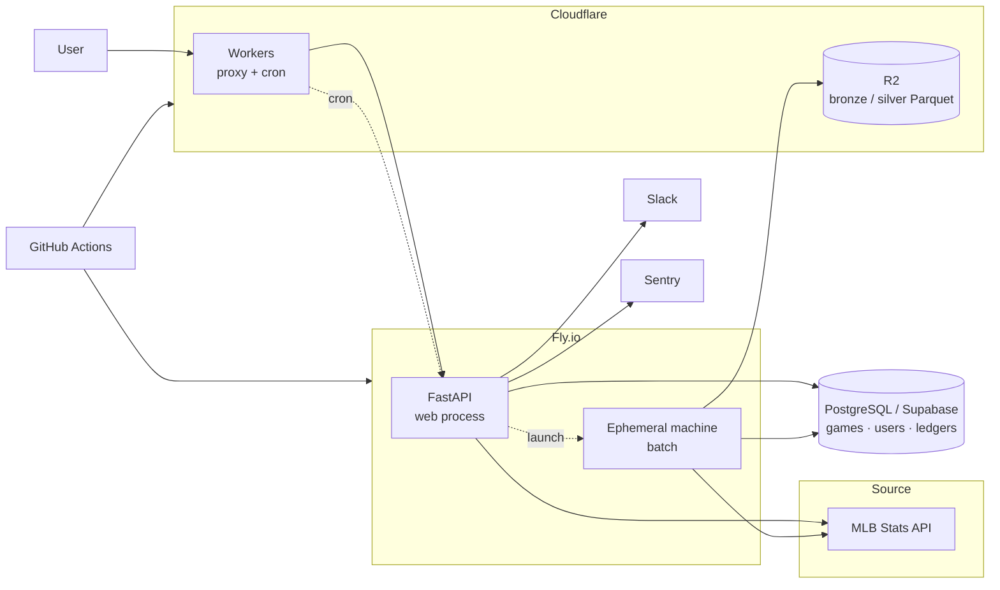

# Sport Data Hub

> 일반 팬도 이해할 수 있는 스포츠 데이터 분석 경험을 만들고, 장기적으로는 종목을 넘어 팀과 선수를 함께 분석하는 데이터 플랫폼을 지향합니다.

## Why this project

Baseball Savant는 매우 깊이 있는 데이터를 제공하고 스카우터, 기자, 분석가 등 전문가에게 강력한 도구입니다. 반면 일반 팬, 특히 한국 사용자 입장에서는 전문 용어와 정보 구조 때문에 처음 접근하기 어렵다는 문제가 있습니다.

Sport Data Hub는 여기서 출발했습니다.

1. **전문가용 데이터의 진입장벽을 낮춥니다.**  
   기록을 단순 나열하기보다 선수와 경기 맥락을 중심으로 직관적으로 탐색할 수 있게 합니다. 서번트가 어려운 진짜 이유는 언어가 아니라 무엇을 봐야 하는지 알려주지 않는 것이라고 보고, 질문 아래에 지표를 배치하는 구조를 택했습니다.

2. **스포츠별로 분리된 데이터 경험을 하나의 플랫폼으로 확장합니다.**  
   현재는 MLB를 중심으로 구현하고 있으며, 스포츠마다 다른 원천 API를 공통된 탐색 경험으로 연결하는 방향을 검토하고 있습니다.

3. **조회형 서비스에서 분석형 데이터 제품으로 발전시키는 것을 목표로 합니다.**  
   장기적으로는 팀의 강점과 약점을 데이터로 설명하고, 전력 보강에 필요한 선수 유형과 후보를 제안하는 플랫폼을 지향합니다.

## Current scope

현재 구현은 **MLB 중심**이며 실제로 운영 중입니다.

**화면**
- 홈: 라이브 티커, 선수 검색, 인기 검색 TOP 10, 스코어보드(대표팀을 정하면 그 팀이 맨 앞)
- 선수 상세: 히어로, 21열 시즌 표(최근 3시즌 · 10시즌 · 전 기간, 구간 합계), 등급 카드, 최근 10경기 게임로그, 최근 vs 시즌 비교, 스트라이크존 핫·콜드 맵, 투수 구종별 투구 위치, 타자 발사각·타구속도 분포, 신인 시즌 배지
- 팀 상세: 개요(시즌 성적 · 최근 결과 · 다음 경기 · 지구 순위 · 포스트시즌 진출 확률 · 팀 리더 · 선발 로테이션 · 부상자 명단), 로스터, 트랜잭션, 상대 전적, 핵심 선수, 최근 상승세·하락세
- 리더보드
- 구글 로그인, 관심 선수, 대표팀(MyTeam), 계정 삭제
- 한국어·영어, 라이트·다크. 화면의 날짜는 보는 사람의 시간대로 표시

**데이터 기반**
- 끝난 경기는 자체 DB에서 읽고, 원천(MLB Stats API)은 배치만 부릅니다
- 경기 피드(`playByPlay`)를 Cloudflare R2에 Parquet으로 쌓는 창고가 매일 자동으로 돕니다. 원본 그대로의 브론즈 층과 고정 스키마의 실버 층까지 만들어져 있고, 화면이 읽을 마트 층이 다음 단계입니다
- 포스트시즌 진출 확률을 매일 5만 회 시뮬레이션으로 계산해 저장합니다
- 슬랙 알림, Sentry, 블루그린 배포

다른 스포츠는 아직 동일 수준으로 구현하지 않았으며, MLB 버전을 먼저 충분히 완성한 뒤 확장하는 방식으로 진행하고 있습니다.

## Architecture

사용자 요청 경로에는 원천 API 호출이 거의 남아 있지 않습니다. 끝난 경기는 Postgres에서 읽고, 경기 피드는 배치가 하루 한 번 받아 R2에 쌓습니다. 배치는 웹 프로세스 안에서 돌지 않고 크론이 띄운 일회용 머신에서 돌다가 사라집니다.

자세한 구조는 [Architecture](docs/architecture.md), 창고 설계는 [Data Strategy](docs/data-strategy.md)에 정리했습니다.

## My role

이 프로젝트에서 제 역할은 **문제 정의, 제품 요구사항, 데이터 활용 방식, 시스템 구조를 설계하고 구현 결과를 검증하는 것**입니다.

구현은 주로 **Claude Code를 활용한 AI-assisted development** 방식으로 진행하고 있습니다. 코드 자체를 제가 모두 직접 작성했다고 표현하지 않습니다. 대신 다음 영역을 중심으로 개발을 주도합니다.

- 어떤 사용자 문제를 풀 것인지 정의
- 어떤 데이터를 어떤 단위로 수집/가공/노출할지 결정
- API latency, 메모리, 운영 비용을 고려한 architecture 선택
- Claude Code가 제안/구현한 결과의 동작과 trade-off 검토
- 실제 응답 시간과 메모리 사용량을 측정하고 다음 개선 방향 결정
- 기능 요구사항과 acceptance criteria를 반복적으로 조정

작업은 **설계 논의 → 구현 → 측정과 보고**의 순서를 지킵니다. 코드를 쓰기 전에 요약·기능 목록·기능별 설계를 먼저 받아 검토하고, 구현이 끝나면 정해진 보고 형식으로 결과와 확인할 것을 받습니다. 자세한 방식은 [AI-assisted Development](docs/ai-assisted-development.md)에 정리했습니다.

## Key design decisions

아래 결정은 전부 실제 측정값 위에서 내렸습니다. 숫자는 이 프로젝트에서 잰 것입니다.

### 1. 원천 API 의존을 최소화한다

원칙은 "트래픽은 우리 서버가 받고, 원천은 배치만 부른다"입니다. 끝난 경기는 결과가 다시 바뀌지 않는데도 요청마다 원천을 다시 부르고 있었습니다. 확정된 날짜를 Postgres에서 읽게 바꾸자 요청 34번 기준 원천 호출이 68회에서 28회로 줄었습니다. 그 과정에서 캐시 효과를 과대평가하지 않으려 실제 적중률을 쟀고(18%), 절감의 70%는 캐시가 아니라 DB 읽기 경로에서 왔다는 것을 확인했습니다.

### 2. 창고는 Postgres가 아니라 R2 Parquet + DuckDB

경기 피드를 시즌 단위로 쌓으면 Postgres에서는 시즌당 143MB(행 부담과 인덱스)인데 Supabase 무료 한도가 500MB입니다. 같은 데이터가 Parquet + zstd로는 17~25MB입니다. 이 제약 때문에 DB 이전(OCI)까지 계획했다가, 마트를 창고에 두면 그 제약 자체가 사라진다는 것을 알고 되돌렸습니다. 결국 프론트·워커·크론이 이미 있는 Cloudflare의 R2를 골랐습니다. S3와 API가 같아 DuckDB의 `httpfs`가 그대로 붙고, 무료 한도(저장 10GB · 쓰기 100만/월 · 읽기 1000만/월 · egress 무료) 안에서 10시즌이 1.5GB입니다.

### 3. 브론즈는 값을 바꾸지 않고, 실버는 행을 거르지 않는다

브론즈는 경기 피드의 모든 이벤트를 평탄하게 편 것입니다. 반올림도 타입 강제도 NULL 치환도 하지 않으며, 원본 JSON을 따로 보관하지 않는 대신 8경기 125,000개 스칼라를 원본과 대조해 0건 변화를 확인했습니다. 편 것이 원본 JSON 압축과 같은 크기(경기당 74.3KB 대 75KB)이면서 SQL로 읽힙니다.

실버는 고정 127열이고 브론즈와 행 수가 같습니다. 변환은 DuckDB SQL 한 문장이며 파이썬이 행을 만지지 않습니다. 행 수는 관찰이 아니라 강제입니다. 쓰기 전에 검사해서 다르면 파일을 올리지 않습니다. 어느 날짜가 어느 규칙 버전으로 만들어졌는지는 Postgres 장부가 알고, 규칙을 고치면 번호 하나를 올려 낡은 날짜가 저절로 다시 만들어집니다.

### 4. 드리프트는 관문이 아니라 관찰

원천이 필드를 더하거나 타입을 바꿔도 브론즈는 무조건 씁니다. 대신 처음 보는 열, 타입 변경, 처음 보는 값을 Postgres 표에 "처음 본 날"과 함께 남기고 슬랙에 알립니다. 기준선을 JSON 파일이 아니라 표에 둔 이유는, "이 열을 처음 본 날이 언제인가"는 코드가 아니라 데이터에 대한 사실이기 때문입니다. 받아들이는 데 배포가 필요 없습니다.

### 5. 배치는 웹 프로세스 밖에서

크론이 잡을 부르면 웹 프로세스는 Fly Machines API로 일회용 머신을 하나 띄우고 0.2초 만에 돌아옵니다. 머신은 웹과 같은 이미지로 뜨고, 배치를 돌리고, 끝나면 스스로 사라집니다. 배포와 겹치는 창이 하루 16초에서 0.2초로 줄었고, 잡마다 메모리를 따로 줄 수 있으며, 초 단위 과금이라 월 $0.001입니다. 블루그린 배포 중에 `sleep` 머신을 띄워 두고 배포가 그 머신을 건드리지 않는 것을 실측했습니다.

### 6. 화면의 날짜는 보는 사람의 시간대

MLB의 경기일은 미국 동부 달력입니다. 데이터의 정체성으로는 그대로 두되(API 인자·키·정렬), 화면에 찍는 날짜만 경기 시작 시각을 보는 사람의 시간대로 바꾼 달력 날짜로 통일했습니다. "한국이면 +1일" 같은 근사는 시간대마다 틀리므로 쓰지 않았고, 시각이 없는 달력 사건(트랜잭션·부상자 명단)은 그대로 두고 "현지 기준"을 답니다.

## Tech stack

**Backend**
- Python 3.12, FastAPI, SQLAlchemy / Alembic
- PostgreSQL (Supabase)
- DuckDB (창고 읽기·쓰기), Parquet + zstd

**Frontend**
- React 19, TypeScript, Vite
- TanStack Query, react-router
- Tailwind CSS v4 / shadcn

**Infrastructure / Operations**
- Fly.io (웹 프로세스, 배치용 일회용 머신, 블루그린 배포)
- Cloudflare Workers (프록시, 크론), R2 (창고)
- GitHub Actions (CI: 테스트 · 마이그레이션 up/down · 빌드, CD)
- Sentry, Slack Alerting

**AI-assisted Development**
- Claude Code

## Repository guide

이 repository는 실제 production source 전체를 공개하는 저장소가 아니라 **설계와 문제 해결 과정을 설명하기 위한 showcase repository**입니다.

- [Architecture](docs/architecture.md) — 현재 서비스 구조, 읽기 경로, 배치 실행, 창고
- [Data Strategy](docs/data-strategy.md) — 창고를 어디에 어떻게 두었는가, 다음 단계
- [AI-assisted Development](docs/ai-assisted-development.md) — Claude Code와 협업하는 방식과 실제 사례
- [Roadmap](docs/roadmap.md) — MLB에서 multi-sport analytics로 확장하는 계획
- [Silver Transform Example](examples/silver-transform.py) — 그날 파일에 어느 열이 있는지 보고 SQL 한 문장을 조립하는 예제
- [Cache Strategy Example](examples/cache-strategy.py) — cache boundary를 단순화한 예제
- [Player Ranking Example](examples/player-ranking.py) — 사용자 행동 기반 인기 선수 집계 예제
- [Pitch Pipeline Example](examples/pitch-pipeline.py) — 경기 단위 데이터를 선수 시즌 데이터로 조합하는 예제

> 예제 코드는 private production repository의 구조를 설명하기 위해 축약/재구성한 코드입니다. 실제 구현은 Claude Code를 활용해 개발했으며, 이 저장소는 제가 직접 작성한 코드의 양을 증명하기보다 **어떤 문제를 어떻게 설계하고 검증했는지**를 보여주는 것을 목적으로 합니다.

## Status

운영 중인 개인 프로젝트입니다. MLB 탐색 화면과 창고의 브론즈·실버 층까지 만들었고, 다음은 화면이 읽을 마트 층과 그 위의 첫 스탯캐스트 시각화(스프레이 산포도)입니다.

See: [Roadmap](docs/roadmap.md)
