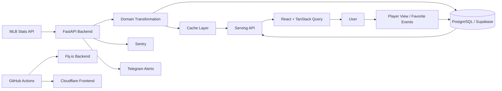

# Sport Data Hub

> 일반 팬도 이해할 수 있는 스포츠 데이터 분석 경험을 만들고, 장기적으로는 종목을 넘어 팀과 선수를 함께 분석하는 데이터 플랫폼을 지향합니다.

## Why this project

Baseball Savant는 매우 깊이 있는 데이터를 제공하고 스카우터, 기자, 분석가 등 전문가에게 강력한 도구입니다. 반면 일반 팬, 특히 한국 사용자 입장에서는 전문 용어와 정보 구조 때문에 처음 접근하기 어렵다는 문제가 있습니다.

Sport Data Hub는 여기서 출발했습니다.

1. **전문가용 데이터의 진입장벽을 낮춥니다.**  
   기록을 단순 나열하기보다 선수와 경기 맥락을 중심으로 직관적으로 탐색할 수 있게 합니다.

2. **스포츠별로 분리된 데이터 경험을 하나의 플랫폼으로 확장합니다.**  
   현재는 MLB를 중심으로 구현하고 있으며, 스포츠마다 다른 원천 API를 공통된 탐색 경험으로 연결하는 방향을 검토하고 있습니다.

3. **조회형 서비스에서 분석형 데이터 제품으로 발전시키는 것을 목표로 합니다.**  
   장기적으로는 팀의 강점과 약점을 데이터로 설명하고, 전력 보강에 필요한 선수 유형과 후보를 제안하는 플랫폼을 지향합니다.

## Current scope

현재 구현은 **MLB 중심**입니다.

- 선수 검색 및 선수 상세
- 최근 경기 기록과 시즌 기록
- 경기 스코어보드
- 타격 zone 데이터
- 투수의 경기별 play-by-play 기반 투구 위치/구종 데이터
- 사용자 조회 데이터를 이용한 인기 선수 집계
- Google OAuth 로그인 및 관심 선수 저장
- 실제 서비스 배포 및 오류 관찰 환경

다른 스포츠는 아직 동일 수준으로 구현하지 않았으며, MLB 버전을 먼저 충분히 완성한 뒤 확장하는 방식으로 진행하고 있습니다.

## Architecture

현재 구조와 향후 데이터 플랫폼 확장 방향은 [Architecture](docs/architecture.md)와 [Data Strategy](docs/data-strategy.md)에 정리했습니다.

## My role

이 프로젝트에서 제 역할은 **문제 정의, 제품 요구사항, 데이터 활용 방식, 시스템 구조를 설계하고 구현 결과를 검증하는 것**입니다.

구현은 주로 **Claude Code를 활용한 AI-assisted development** 방식으로 진행하고 있습니다. 코드 자체를 제가 모두 직접 작성했다고 표현하지 않습니다. 대신 다음 영역을 중심으로 개발을 주도합니다.

- 어떤 사용자 문제를 풀 것인지 정의
- 어떤 데이터를 어떤 단위로 수집/가공/노출할지 결정
- API latency, 메모리, 운영 비용을 고려한 architecture 선택
- Claude Code가 제안/구현한 결과의 동작과 trade-off 검토
- 실제 응답 시간과 메모리 사용량을 측정하고 다음 개선 방향 결정
- 기능 요구사항과 acceptance criteria를 반복적으로 조정

자세한 방식은 [AI-assisted Development](docs/ai-assisted-development.md)에 정리했습니다.

## Key design decisions

### 1. 모든 데이터를 같은 방식으로 캐시하지 않기

선수 상세 페이지는 여러 MLB Stats API를 조합하기 때문에 외부 API latency가 전체 응답 시간의 큰 부분을 차지합니다. 이를 단순히 하나의 큰 cache로 감추기보다 데이터 성격에 따라 cache 단위를 나눴습니다.

- Player/season response: 비교적 짧은 TTL
- League aggregate: 더 긴 TTL
- Game play-by-play: 경기 단위 cache
- User behavior: cache가 아니라 PostgreSQL에 지속 저장

현재는 process-local cache를 사용하지만, 데이터량과 트래픽이 증가하면 Redis와 DW/DB 적재를 선택적으로 도입할 수 있도록 경계를 분리하는 방향으로 설계하고 있습니다.

### 2. 조회 순위와 선수 데이터의 변화 주기를 분리하기

인기 선수 순위는 사용자 조회가 발생할 때마다 바뀌지만, 선수 프로필과 시즌 기록은 같은 주기로 변하지 않습니다. 따라서 인기 목록 전체를 캐시하기보다 선수 데이터를 player 단위로 캐시하는 방식을 선택했습니다.

실제 측정에서 DB 집계보다 외부 API를 통해 선수 정보를 조립하는 시간이 훨씬 컸고, warm cache 상태에서 인기 선수 endpoint의 응답 시간을 크게 줄일 수 있었습니다.

### 3. 실시간 조회와 분석용 데이터를 분리할 준비하기

현재 서비스는 외부 API를 중심으로 데이터를 가져와 가공하고 서빙합니다. 하지만 팀 강·약점 분석이나 선수 추천처럼 반복적이고 복합적인 분석이 늘어나면 on-demand API 호출만으로는 한계가 있습니다.

따라서 다음 단계에서는 완료된 경기와 과거 기록처럼 변경되지 않는 데이터를 별도 ingestion하여 Raw / Curated 계층으로 관리하는 DW 구조를 검토하고 있습니다.

## Tech stack

**Backend**
- Python 3.12
- FastAPI
- SQLAlchemy / Alembic
- PostgreSQL (Supabase)

**Frontend**
- React
- TypeScript
- TanStack Query
- Tailwind CSS / shadcn

**Infrastructure / Operations**
- Fly.io
- Cloudflare
- GitHub Actions
- Sentry
- Telegram Alerting

**AI-assisted Development**
- Claude Code

## Repository guide

이 repository는 실제 production source 전체를 공개하는 저장소가 아니라 **설계와 문제 해결 과정을 설명하기 위한 showcase repository**입니다.

- [Architecture](docs/architecture.md) — 현재 서비스 구조와 설계 판단
- [Data Strategy](docs/data-strategy.md) — cache와 DW를 포함한 데이터 전략
- [AI-assisted Development](docs/ai-assisted-development.md) — Claude Code와 협업하는 방식
- [Roadmap](docs/roadmap.md) — MLB에서 multi-sport analytics로 확장하는 계획
- [Cache Strategy Example](examples/cache-strategy.py) — cache boundary를 단순화한 예제
- [Player Ranking Example](examples/player-ranking.py) — 사용자 행동 기반 인기 선수 집계 예제
- [Pitch Pipeline Example](examples/pitch-pipeline.py) — 경기 단위 데이터를 선수 시즌 데이터로 조합하는 예제

> 예제 코드는 private production repository의 구조를 설명하기 위해 축약/재구성한 코드입니다. 실제 구현은 Claude Code를 활용해 개발했으며, 이 저장소는 제가 직접 작성한 코드의 양을 증명하기보다 **어떤 문제를 어떻게 설계하고 검증했는지**를 보여주는 것을 목적으로 합니다.

## Status

현재 진행 중인 개인 프로젝트입니다. MLB 데이터 탐색 경험을 먼저 안정적으로 완성한 뒤 데이터 저장 구조와 분석 기능을 확장하고 있습니다.

See: [Roadmap](docs/roadmap.md)
