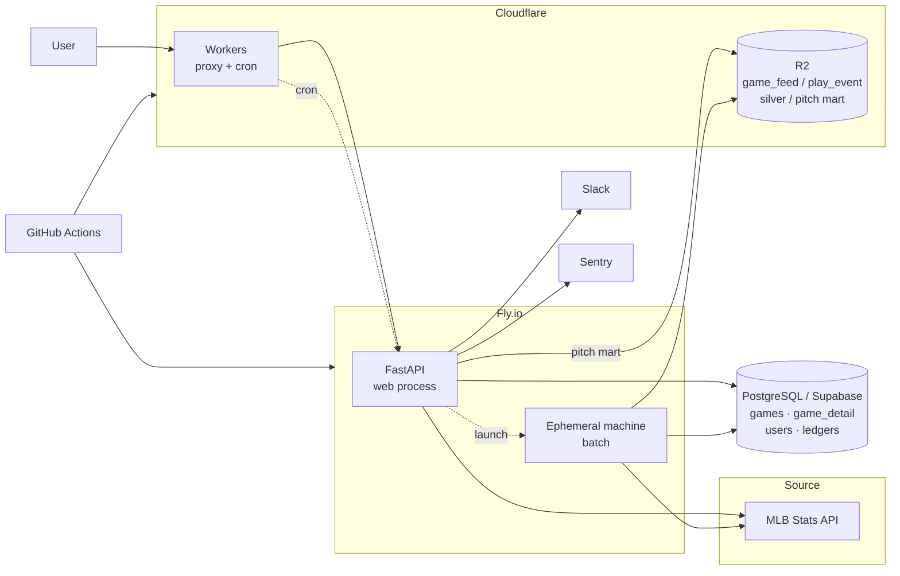

# Sport Data Hub

**멀티 스포츠 데이터 플랫폼**

[Let's go to the Sport Data Hub ⚾️](https://sport-data-hub.net/)

일반 팬도 이해할 수 있는 스포츠 데이터 분석 경험을 만들고, 장기적으로는 종목을 넘어 팀과 선수를 함께 분석하는 데이터 플랫폼을 지향합니다.

## Why this project

Baseball Savant는 매우 깊이 있는 데이터를 제공하고 스카우터, 기자, 분석가 등 전문가에게 강력한 도구입니다. 반면 일반 팬, 특히 한국 사용자 입장에서는 전문 용어와 정보 구조 때문에 처음 접근하기 어렵다는 문제가 있습니다.

Sport Data Hub는 여기서 출발했습니다.

1. **전문가용 데이터의 진입장벽을 낮춥니다.**  
   기록을 단순 나열하기보다 선수와 경기 맥락을 중심으로 직관적으로 탐색할 수 있게 합니다. 서번트가 어려운 진짜 이유는 언어가 아니라 무엇을 봐야 하는지 알려주지 않는 것이라고 보고, 질문 아래에 지표를 배치하는 구조를 택했습니다.

2. **스포츠별로 분리된 데이터 경험을 하나의 플랫폼으로 확장합니다.**  
   현재는 MLB를 중심으로 구현하고 있으며, 스포츠마다 다른 원천 API를 공통된 탐색 경험으로 연결하는 방향을 검토하고 있습니다.

3. **조회형 서비스에서 분석형 데이터 제품으로 발전시키는 것을 목표로 합니다.**  
   장기적으로는 팀의 강점과 약점을 데이터로 설명하고, 전력 보강에 필요한 선수 유형과 후보를 제안하는 플랫폼을 지향합니다.

## Current scope

현재 구현은 **MLB 중심**이며 실제로 운영 중입니다.

**화면**
- 홈: 라이브 티커, 선수 검색, 인기 검색 TOP 10, 스코어보드(대표팀을 정하면 그 팀이 맨 앞)
- 선수 상세: 히어로, 21열 시즌 표(최근 3시즌 · 10시즌 · 전 기간, 구간 합계), 등급 카드, 최근 10경기 게임로그, 최근 vs 시즌 비교, 스트라이크존 핫·콜드 맵, 투수 구종별 투구 위치, 타자 발사각·타구속도 분포, 신인 시즌 배지
- 팀 상세: 개요(시즌 성적 · 최근 결과 · 다음 경기 · 지구 순위 · 포스트시즌 진출 확률 · 팀 리더 · 선발 로테이션 · 부상자 명단), 로스터, 라인업(타순별 출전·OPS 매트릭스와 타순 변화), 트랜잭션, 상대 전적, 핵심 선수, 최근 상승세·하락세
- 리더보드: 타자 · 투수 · 팀
- 전체 일정: 월·일 보기, 날짜 이동, 경기 상세로 연결
- 경기 상세: 요약 · 박스 스코어 · 경기 기록 · 경기 정보. 득점 장면·이닝 필터, 진행 중 경기의 60초 갱신
- 구글 로그인, 관심 선수, 대표팀(MyTeam), 계정 삭제
- 한국어·영어, 라이트·다크. 화면의 날짜는 보는 사람의 시간대로 표시

**데이터 기반**
- 확정된 일정과 저장된 종료 경기 상세는 자체 DB에서 읽습니다. 라이브·미저장 데이터와 폴백에는 MLB Stats API를 사용합니다
- 경기 피드 원문(`feed/live`)과 평탄화 이벤트를 Cloudflare R2에 따로 보관하고, **실버 128열 → 투구 마트 41열**까지 매일 자동으로 만듭니다
- 투수 상세는 마트를 우선 읽고, 마지막 적재일 이후 등판만 원천으로 보완합니다. 마트가 없거나 조회에 실패하면 기존 경기 피드 경로로 돌아갑니다
- 종료 경기 상세는 압축 응답을 DB에 저장합니다. 응답 버전이 바뀌면 매시간 잡이 재조립 머신을 띄워 저장된 경기 원문으로 다시 만듭니다
- 포스트시즌 진출 확률을 매일 5만 회 시뮬레이션으로 계산해 저장합니다
- 슬랙 알림, Sentry, 블루그린 배포

다른 스포츠는 아직 동일 수준으로 구현하지 않았으며, MLB 버전을 먼저 충분히 완성한 뒤 확장하는 방식으로 진행하고 있습니다.

## Architecture

확정된 일정과 저장된 경기 상세는 Postgres에서, 투구 분석은 R2 마트에서 읽습니다. 라이브·미저장 데이터, 마트 이후 등판과 폴백에는 원천 호출이 남아 있습니다. 경기·확률 잡은 웹 프로세스에서 실행하고, 무거운 창고 작업과 상세 재조립은 일회용 머신으로 분리합니다.

자세한 구조는 [Architecture](docs/architecture.md), 창고 설계는 [Data Strategy](docs/data-strategy.md)에 정리했습니다.

## My role

이 프로젝트에서 제 역할은 **문제 정의, 제품 요구사항, 데이터 활용 방식, 시스템 구조를 설계하고 구현 결과를 검증하는 것**입니다.

구현은 주로 **Claude Code를 활용한 AI-assisted development** 방식으로 진행하고 있습니다. 코드 자체를 제가 모두 직접 작성했다고 표현하지 않습니다. 대신 다음 영역을 중심으로 개발을 주도합니다.

- 어떤 사용자 문제를 풀 것인지 정의
- 어떤 데이터를 어떤 단위로 수집/가공/노출할지 결정
- API latency, 메모리, 운영 비용을 고려한 architecture 선택
- Claude Code가 제안/구현한 결과의 동작과 trade-off 검토
- 실제 응답 시간과 메모리 사용량을 측정하고 다음 개선 방향 결정
- 기능 요구사항과 acceptance criteria를 반복적으로 조정

작업은 **설계 논의 → 구현 → 측정과 보고**의 순서를 지킵니다. 코드를 쓰기 전에 요약·기능 목록·기능별 설계를 먼저 받아 검토하고, 구현이 끝나면 정해진 보고 형식으로 결과와 확인할 것을 받습니다. 자세한 방식은 [AI-assisted Development](docs/ai-assisted-development.md)에 정리했습니다.

## Key design decisions

아래에는 설계 판단과 기존 개발 기록의 측정 사례를 함께 남겼습니다. 과거 수치는 당시 조건의 결과이며, 이번 문서 갱신에서 운영 성능이나 비용을 다시 측정한 것은 아닙니다.

### 1. 원천 API 의존을 최소화한다

목표는 "트래픽은 우리 서버가 받고, 원천 호출은 가능한 한 배치로 옮긴다"입니다. 종료 경기의 동일 결과를 요청마다 원천에서 다시 받고 있었습니다. 확정된 날짜를 Postgres에서 읽게 바꾸자 요청 34번 기준 원천 호출이 68회에서 28회로 줄었습니다. 그 과정에서 캐시 효과를 과대평가하지 않으려 실제 적중 횟수를 확인했고, 절감의 70%는 캐시가 아니라 DB 읽기 경로에서 왔다는 것을 확인했습니다.

### 2. 창고는 Postgres가 아니라 R2 Parquet + DuckDB

당시 검토에서 Postgres 마트는 행 부담과 인덱스 때문에 저장 비용이 컸습니다. 프론트·워커·크론을 이미 운영하던 Cloudflare의 R2에 Parquet을 두고 DuckDB로 읽는 구조를 택했습니다. 현재는 원문·이벤트·실버·마트를 함께 보관하므로, 예전의 일부 데이터 압축 크기를 전체 창고 용량으로 설명하지 않습니다. 층별 역할은 [Data Strategy](docs/data-strategy.md)에 정리했습니다.

### 3. 브론즈는 값을 바꾸지 않고, 실버는 행을 거르지 않는다

브론즈는 두 종류입니다. `game_feed`는 전체 경기 원문을 JSON 문자열로 보관하고, `play_event`는 그 안의 이벤트를 평탄하게 폅니다. 원문은 경기 상세를 다시 조립하는 재료이고, 이벤트는 분석 SQL의 재료입니다. 기존 이벤트 검증에서는 8경기 125,000개 스칼라를 대조해 값 변화가 없음을 확인했습니다.

실버는 고정 128열이고 브론즈와 행 수가 같습니다. 변환은 DuckDB SQL 한 문장이며 파이썬이 행을 만지지 않습니다. 행 수는 관찰이 아니라 강제입니다. 쓰기 전에 검사해서 다르면 파일을 올리지 않습니다. 어느 날짜가 어느 규칙 버전으로 만들어졌는지는 Postgres 장부가 알고, 규칙 버전으로 낡은 날짜를 찾습니다. 일일 자동 재처리는 최근 3일 범위이므로, 과거 날짜는 별도 백필로 채워야 합니다.

### 4. 드리프트는 관문이 아니라 관찰

원천이 필드를 더하거나 타입을 바꿔도 브론즈는 무조건 씁니다. 대신 처음 보는 열, 타입 변경, 처음 보는 값을 Postgres 표에 "처음 본 날"과 함께 남기고 슬랙에 알립니다. 기준선을 JSON 파일이 아니라 표에 둔 이유는, "이 열을 처음 본 날이 언제인가"는 코드가 아니라 데이터에 대한 사실이기 때문입니다. 받아들이는 데 배포가 필요 없습니다.

### 5. 배치는 웹 프로세스 밖에서

창고 잡은 웹 프로세스가 Fly Machines API로 일회용 머신을 띄운 뒤 돌아오는 구조입니다. 현재 1GB 머신 하나에서 브론즈 → 실버 → 마트를 순서대로 처리합니다. 브론즈가 있는 날짜 중 현재 버전 실버가 하나라도 빠져 있으면 마트를 갱신하지 않아 불완전한 시즌으로 덮어쓰는 일을 막습니다. 경기 상세의 응답 버전이 바뀌었을 때도 별도 머신이 원문으로 재조립합니다.

### 6. 화면의 날짜는 보는 사람의 시간대

MLB의 경기일은 미국 동부 달력입니다. 데이터의 정체성으로는 그대로 두되(API 인자·키·정렬), 화면에 찍는 날짜만 경기 시작 시각을 보는 사람의 시간대로 바꾼 달력 날짜로 통일했습니다. "한국이면 +1일" 같은 근사는 시간대마다 틀리므로 쓰지 않았고, 시각이 없는 달력 사건(트랜잭션·부상자 명단)은 그대로 두고 "현지 기준"을 답니다.

### 7. 마트 우선 조회와 원문 재사용

투구 마트는 날짜별 실버를 시즌 파일 하나로 합쳐 투수순으로 정렬합니다. 화면은 `through_date`까지의 마트와 그 뒤의 등판 피드를 합칩니다. 창고 장애나 미구축 시즌에는 전체 원천 경로로 돌아갑니다. 경기 상세 역시 현재 버전의 DB 응답을 먼저 읽고, 낡거나 없으면 원천으로 조립합니다. 분석용 마트와 화면용 응답의 역할은 다르지만, 저장된 재료를 우선 재사용한다는 원칙은 같습니다.

## Tech stack

**Backend**
- Python 3.12, FastAPI, SQLAlchemy / Alembic
- PostgreSQL (Supabase)
- DuckDB (창고 읽기·쓰기), Parquet + zstd

**Frontend**
- React 19, TypeScript, Vite
- TanStack Query, react-router
- Tailwind CSS v4 / shadcn

**Infrastructure / Operations**
- Fly.io (웹 프로세스, 배치용 일회용 머신, 블루그린 배포)
- Cloudflare Workers (프록시, 크론), R2 (창고)
- GitHub Actions (CI: 테스트 · 마이그레이션 up/down · 빌드, CD)
- Sentry, Slack Alerting

**AI-assisted Development**
- Claude Code

## Repository guide

이 repository는 실제 production source 전체를 공개하는 저장소가 아니라 **설계와 문제 해결 과정을 설명하기 위한 showcase repository**입니다.

- [Architecture](docs/architecture.md) — 현재 서비스 구조, 읽기 경로, 배치 실행, 창고
- [Data Strategy](docs/data-strategy.md) — 창고를 어디에 어떻게 두었는가, 다음 단계
- [AI-assisted Development](docs/ai-assisted-development.md) — Claude Code와 협업하는 방식과 실제 사례
- [Roadmap](docs/roadmap.md) — MLB에서 multi-sport analytics로 확장하는 계획
- [Silver Transform Example](examples/silver-transform.py) — 그날 파일에 어느 열이 있는지 보고 SQL 한 문장을 조립하는 예제
- [Cache Strategy Example](examples/cache-strategy.py) — cache boundary를 단순화한 예제
- [Player Ranking Example](examples/player-ranking.py) — 사용자 행동 기반 인기 선수 집계 예제
- [Pitch Pipeline Example](examples/pitch-pipeline.py) — 마트 우선 조회, 최신 등판 보완과 폴백 예제
- [Pitch Mart Example](examples/pitch-mart.py) — 실버의 투구 행을 시즌 마트로 만드는 실행 가능한 축약 예제
- [동기화 기록](docs/source-sync.md) — 확인한 소스 버전, 변경 근거와 검증 범위

> 예제 코드는 private production repository의 구조를 설명하기 위해 축약/재구성한 코드입니다. 실제 구현은 Claude Code를 활용해 개발했으며, 이 저장소는 제가 직접 작성한 코드의 양을 증명하기보다 **어떤 문제를 어떻게 설계하고 검증했는지**를 보여주는 것을 목적으로 합니다.

## Status

운영 중인 개인 프로젝트입니다. MLB 선수·팀·일정·경기 상세와 브론즈·실버·투구 마트 조회가 구현되어 있습니다. 다음 분석 확장은 퍼센타일, 실제 대 기대, 롤링 트렌드와 스프레이·무브먼트입니다. Savant 데이터 확보 조사와 서비스 연동 완료는 구분하며, 다종목 지원과 선수 추천은 아직 계획입니다.

See: [Roadmap](docs/roadmap.md)
