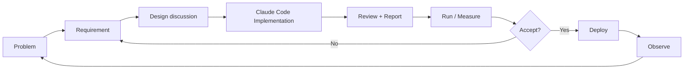

# AI-assisted Development

## Why Claude Code is part of the project

Sport Data Hub는 개인 프로젝트이기 때문에 제품 기획, 데이터 설계, Backend, Frontend, 배포를 한 사람이 모두 직접 구현하려면 개발 속도가 크게 제한됩니다.

그래서 Claude Code를 단순 autocomplete가 아니라 **implementation agent**로 활용하고 있습니다.

중요한 점은 "AI가 코드를 작성했다"는 사실을 숨기지 않는 것입니다. 이 프로젝트에서 제가 보여주고 싶은 역량은 타이핑한 코드의 양이 아니라 **문제를 정의하고, 설계 결정을 내리고, AI가 만든 결과를 검증하며 서비스를 완성하는 과정**입니다.

## Role split

### I own

- 문제 정의
- 사용자 경험과 제품 요구사항
- 어떤 데이터를 사용할지 결정
- 데이터 모델과 system boundary 결정
- 성능/비용/운영 제약 정의
- 구현 결과 리뷰
- 측정 결과 해석
- architecture 변경 여부 결정
- 다음 iteration의 요구사항 작성

### Claude Code primarily handles

- 구현 코드 작성
- 반복적인 Backend / Frontend 코드 생성
- 테스트 코드 초안
- refactoring 제안 및 적용
- 측정 스크립트 작성과 실행
- 문서화 보조

Claude의 제안을 자동으로 정답으로 간주하지 않습니다. 기술적으로 합리적인지, 현재 서비스의 목적과 제약에 맞는지 검토한 뒤 선택합니다.

## Working agreement

저장소의 `CLAUDE.md`에 작업 방식을 적어 두고 그대로 따르게 합니다.

1. 요구를 분석해 **요약 · 필요 기능 목록 · 기능별 설계**를 먼저 낸다
2. 제가 코드 작성을 요구하기 전까지는 **설계 논의를 깊게** 가져간다
3. 구현이 끝나면 정해진 형식으로 보고한다: 작업 내용, 발생·발견한 이슈(코드 위치 포함), 세부(설계와 비교, 관련 코드), **제가 같이 확인하면 좋은 것**(기능·디자인·서비스 관점의 체크리스트), 그외

이 형식이 있어서 "동작한다"에서 끝나지 않고 "무엇을 확인해야 하는지"까지 매번 받습니다. 아래 사례의 측정과 되돌림은 대부분 이 논의 단계에서 나왔습니다.

## Development loop



## Example 1: 캐시를 과대평가하지 않기

스코어보드가 요청마다 원천 API를 부르고 있었습니다. 처음 제안은 캐시였고, 캐시를 붙이면 좋아진다는 설명이 따라왔습니다.

저는 "캐시가 없는 거나 다름없는 효과를 개선이라고 과대 해석하는 것 같다"고 되돌렸습니다. 당일에는 도움이 되지만 장기적으로는 없는 것과 같은 효과였기 때문입니다.

그래서 먼저 재게 했습니다.

```text
스코어보드 캐시 실제 적중: 28번 중 6번 (18%)
절감의 70%: DB 읽기 경로
절감의 30%: 캐시
```

결론은 캐시가 아니라 **원천 의존 최소화**를 원칙으로 세우는 것이었습니다. 끝난 경기는 배치가 DB에 담고 화면은 그것을 읽습니다. 배포 뒤 실측으로 요청 34번에 원천 호출이 68회에서 28회로 줄었습니다. 이 원칙이 이후 창고 설계의 출발점이 됐습니다.

## Example 2: "월별로 묶으면 안 되나?"

브론즈 층을 날짜 단위 파일로 설계했을 때, 저는 R2의 쓰기 비용(Class A)을 아끼려고 날짜마다 쓰는 것을 피한 것인지 물었습니다. 답은 "그것이 이유가 아니다"였고, 대신 실제로 묶어 보게 했습니다.

| | 하루 단위 (30파일) | 월 단위 (1파일) |
|---|---|---|
| 콜드 조회 | 8.14초 | **0.57초** |
| 압축 크기 | 23.5MB | 21.9MB |
| 묶는 데 필요한 메모리 | — | **512MB** (256·384MB 실패) |

묶으면 읽기가 14배 빠르지만 512MB 머신에서는 묶을 수 없었고, 하루를 다시 담으려면 그 달을 다시 받아야 했습니다. 그리고 화면은 브론즈를 직접 읽지 않습니다. 결론은 브론즈를 하루 단위로 두고 합치는 일을 마트로 넘기는 것이었습니다. 제 질문이 측정을 시켰고, 측정이 층의 역할을 정했습니다.

같은 방식으로 "실버를 브론즈에서 뽑지 말고 적재할 때 같이 만들면 되지 않나"라는 제 제안은 받아들여졌고(잡이 하나 줄고 파이썬이 행을 안 만지게 됐습니다), "그러면 콜드 조회가 느려진다"는 우려는 "실버를 화면이 직접 읽는 경우가 없으니 걱정할 자리가 아니다"라는 제 지적으로 정리됐습니다.

## Example 3: 증상이 아니라 데이터에서 원인을 찾기

"매번 로그인하게 된다"는 불편을 말했을 때, 설정만 보면 원인이 없었습니다. 리프레시 토큰이 30일이고 쓸 때마다 밀리니 한 달에 한 번만 들러도 안 풀려야 했습니다.

Claude Code가 운영 세션 표를 읽어 이런 흔적을 찾았습니다.

```text
세션 54건 중 53건 폐기
9/4 05:50 UTC — 세션 5개가 같은 순간 폐기 (Mac 3 · Windows 1 · iPhone 1)
발급 6분 만에 끊긴 세션 (액세스 15분 만료 전)
```

원인은 도난 감지였습니다. 한 번 쓴 리프레시 토큰이 다시 오면 그 사용자 세션을 전부 끊는 규칙이, 탭 둘이 같은 순간 갱신하러 오는 정상 상황에서 발동해 세 기기를 한꺼번에 로그아웃시키고 있었습니다.

고침은 규칙을 버리는 것이 아니라 오탐만 걷어내는 것이었습니다. 회전 60초 안의 재사용은 경쟁으로 보고, 탭 사이 갱신을 `navigator.locks`로 한 줄로 세우고, 도난 판정이 발동하면 슬랙에 남깁니다. 이 로그 한 줄이 없어서 원인을 찾는 데 세션 표를 뒤져야 했다는 것도 기록했습니다.

## Example 4: 불변식이 잡은 것

실버 층에 "브론즈와 행 수가 같아야 한다"는 검사를 관찰이 아니라 강제로 넣었습니다. 다르면 파일을 쓰지 않습니다.

이 검사가 세 날짜에서 실패했고, 파고 보니 원천 데이터 모델의 문제였습니다. MLB Stats API가 같은 경기 id를 이틀에 싣는 경우(중단·재개, 연기 후 같은 id로 재편성)가 있는데, 경기 표가 적재한 날을 덮어써서 어느 날을 나중에 담았느냐가 값을 정하고 있었습니다. 같은 코드로 같은 표를 채운 운영과 로컬이 달랐던 이유입니다.

고침은 "공식 경기일이 그날인 목록만 행을 소유한다"였고, 실제 Postgres에서 세 순서를 돌려 확인한 뒤 잘못 나뉜 9일을 다시 담았습니다. 검사를 알림으로만 두었다면 잘못된 파일이 R2에 올라간 뒤에 알았을 것입니다.

## Verification principles

AI-generated output은 주로 다음 기준으로 검증합니다.

1. **Correctness** — 원천 API의 의미를 잘못 해석하지 않았는가? 값이 바뀌지 않았는가?
2. **Latency** — 실제 사용자 요청이 빨라졌는가? 캐시 적중률을 실제로 쟀는가?
3. **Memory** — 512MB 머신 안에 들어오는가? 배치가 하루치를 통째로 들고 있지 않은가?
4. **Failure behavior** — 한 경기의 실패가 그날 전체를 반쪽으로 남기지 않는가? 배포와 겹쳐도 스스로 회복하는가?
5. **Observability** — 문제가 생겼을 때 알 수 있는가? 알림 문구에 날짜·대상·복구 방법이 있는가?
6. **Maintainability** — 규칙이 한 곳에 있는가? 창고와 화면이 같은 상수를 쓰는가?
7. **Product fit** — 기술적으로 멋진 구현보다 실제 사용자 문제를 해결하는가?

## Why this matters

AI가 구현 속도를 크게 높일수록 엔지니어의 역할은 단순 코드 생성보다 다음에 가까워진다고 생각합니다.

```text
Problem framing
→ Constraints
→ Design discussion
→ Verification (measure, don't assume)
→ Iteration
```

Sport Data Hub는 이 개발 방식을 실제 제품에 적용하며 실험하고 있는 프로젝트입니다.
