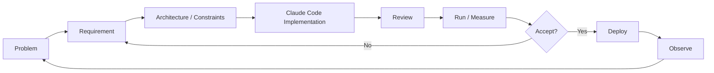

# AI-assisted Development

## Why Claude Code is part of the project

Sport Data Hub는 개인 프로젝트이기 때문에 제품 기획, 데이터 설계, Backend, Frontend, 배포를 한 사람이 모두 직접 구현하려면 개발 속도가 크게 제한됩니다.

그래서 Claude Code를 단순 autocomplete가 아니라 **implementation agent**로 활용하고 있습니다.

중요한 점은 "AI가 코드를 작성했다"는 사실을 숨기지 않는 것입니다. 이 프로젝트에서 제가 보여주고 싶은 역량은 타이핑한 코드의 양이 아니라 **문제를 정의하고, 설계 결정을 내리고, AI가 만든 결과를 검증하며 서비스를 완성하는 과정**입니다.

## Role split

### I own

- 문제 정의
- 사용자 경험과 제품 요구사항
- 어떤 데이터를 사용할지 결정
- 데이터 모델과 system boundary 결정
- 성능/비용/운영 제약 정의
- 구현 결과 리뷰
- 측정 결과 해석
- architecture 변경 여부 결정
- 다음 iteration의 요구사항 작성

### Claude Code primarily handles

- 구현 코드 작성
- 반복적인 Backend / Frontend 코드 생성
- 테스트 코드 초안
- refactoring 제안 및 적용
- 문서화 보조

Claude의 제안을 자동으로 정답으로 간주하지 않습니다. 기술적으로 합리적인지, 현재 서비스의 목적과 제약에 맞는지 검토한 뒤 선택합니다.

## Development loop



## Example: player-detail latency

### 1. Problem

선수 상세 화면은 여러 종류의 MLB 데이터를 조합하기 때문에 페이지 로딩 시간이 길어질 수 있었습니다.

단순히 "빠르게 해줘"라고 요청하지 않고 다음 질문부터 정리했습니다.

- 어떤 upstream request가 병목인가?
- 어떤 데이터는 사용자마다 다른가?
- 어떤 데이터는 여러 요청에서 재사용 가능한가?
- 각 데이터는 언제 갱신되어야 하는가?
- cache가 커질 때 memory limit은 어떻게 되는가?

### 2. Measure first

실제 측정을 통해 DB ranking query보다 MLB Stats API에서 선수 정보를 조립하는 시간이 훨씬 큰 병목이라는 점을 확인했습니다.

따라서 SQL을 더 튜닝하는 대신 player data reuse를 우선하는 것이 맞다고 판단했습니다.

### 3. Architecture decision

인기 선수 순위는 자주 변하지만 선수 데이터는 같은 속도로 변하지 않습니다.

따라서:

```text
Bad fit:
cache(popular_player_list)

Better fit:
ranking from DB
        +
cache(player_id → player data)
```

로 경계를 나눴습니다.

### 4. Review the generated implementation

Claude Code가 cache implementation을 만들더라도 다음과 같은 부분을 검토합니다.

- entry 상한이 있는가?
- TTL이 데이터 특성에 맞는가?
- None/empty result와 cache miss를 구분하는가?
- concurrent access에서 문제가 없는가?
- cache가 실제로 얼마나 사용되는지 볼 수 있는가?
- process-local cache의 한계를 알고 있는가?

기능이 동작한다는 것만으로 완료하지 않고 운영 조건을 포함해 검토합니다.

## Example: cache vs DW

AI에게 모든 latency 문제를 cache로 해결하도록 두지 않습니다.

완료된 경기의 play-by-play처럼 변경되지 않는 데이터가 반복적으로 사용된다면 process cache를 계속 늘리는 것보다 별도 storage에 적재하는 것이 장기적으로 더 합리적입니다.

그래서 현재 질문은 다음과 같습니다.

```text
"When should this stop being a cache problem
and become a data-platform problem?"
```

이 판단을 기반으로 향후 immutable historical data를 ingestion하고 DW/curated layer로 관리하는 구조를 검토하고 있습니다.

## Verification principles

AI-generated output은 주로 다음 기준으로 검증합니다.

1. **Correctness** — 원천 API의 의미를 잘못 해석하지 않았는가?
2. **Latency** — 실제 사용자 요청이 빨라졌는가?
3. **Memory** — cache/response size가 운영 환경 안에 들어오는가?
4. **Failure behavior** — 한 upstream 실패가 전체 화면 실패로 번지지 않는가?
5. **Observability** — 문제가 생겼을 때 알 수 있는가?
6. **Maintainability** — 다음 기능이 들어올 때 현재 구조가 과도한 결합을 만들지 않는가?
7. **Product fit** — 기술적으로 멋진 구현보다 실제 사용자 문제를 해결하는가?

## Why this matters

AI가 구현 속도를 크게 높일수록 엔지니어의 역할은 단순 코드 생성보다 다음에 가까워진다고 생각합니다.

```text
Problem framing
→ Constraints
→ Architecture
→ Verification
→ Iteration
```

Sport Data Hub는 이 개발 방식을 실제 제품에 적용하며 실험하고 있는 프로젝트입니다.
