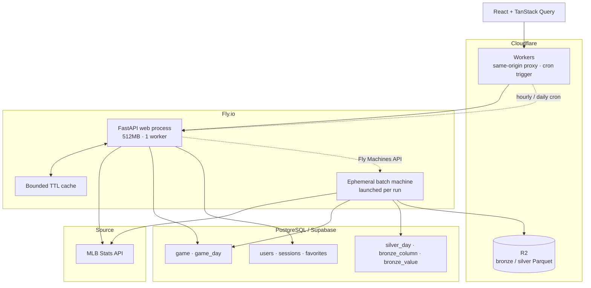
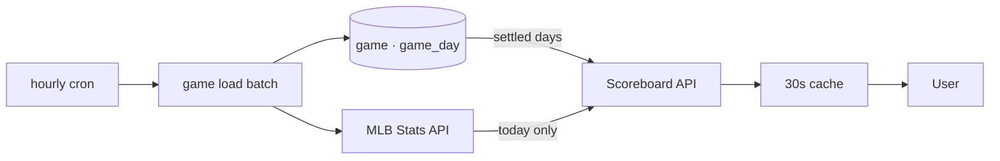

# Architecture

## 1. Current architecture

Sport Data Hub는 **MLB Stats API를 원천으로 쓰되, 사용자 요청 경로에서는 원천을 거의 부르지 않는 구조**입니다. 끝난 경기는 Postgres에서 읽고, 경기 피드는 배치가 받아 R2에 쌓습니다.



핵심은 두 가지입니다. 원천 API 응답을 그대로 전달하지 않고 **사용자가 실제로 탐색하는 단위로 다시 구성한다**는 것, 그리고 **원천 호출을 사용자 요청이 아니라 배치가 한다**는 것입니다.

## 2. Read path: 원천 의존을 최소화한다

원칙은 "트래픽은 우리 서버가 받고, 원천은 배치만 부른다"입니다.

스코어보드가 그 예입니다. 결과가 있는 날짜를 찾아 최대 4일을 되짚으므로 요청 하나에 일정 조회가 다섯 번까지 나갔고, 프론트가 60초마다 폴링하니 방문자 한 명이 한 시간에 300번을 밀어냈습니다. 끝난 경기의 결과는 다시 바뀌지 않는데도 매번 원천을 부른 것입니다.



매시간 도는 배치가 최근 7일의 일정을 받아 `game`에 담고, 그날 경기가 전부 종결되면 `game_day.settled_at`을 찍습니다. 화면은 확정된 날짜를 DB에서, 진행 중인 오늘만 원천에서 읽습니다. 배포 뒤 실측으로 요청 34번에 원천 호출이 68회에서 28회로 줄었습니다.

이때 캐시 효과를 과대평가하지 않으려 했습니다. 스코어보드 캐시의 실제 적중률은 18%(28번 중 6번)였고, 절감의 70%는 캐시가 아니라 DB 읽기 경로에서 왔습니다. 캐시가 "당일에는 도움이 되지만 장기적으로는 없는 것과 같은" 효과를 개선이라고 부르지 않기로 했습니다.

## 3. Cache by data characteristics

캐시는 여전히 있지만 역할이 줄었습니다. 인터페이스를 한 곳으로 모아 bounded size, TTL, 캐시별 lock, hit/miss 관찰을 붙였고, 데이터 성격에 따라 수명을 나눕니다.

| Data | Strategy | Reason |
|---|---|---|
| 스코어보드 | 30초 캐시, 확정된 날짜는 DB | 오늘만 바뀐다 |
| 선수·시즌 응답 | 시간 단위 캐시 | 경기가 끝나야 갱신된다 |
| 리그 집계 | 하루 단위 캐시 | 선수마다 다시 계산할 이유가 없다 |
| 경기 피드 | **창고(R2)** | 끝난 경기는 바뀌지 않는다. 캐시가 아니라 저장의 대상이다 |
| 사용자 행동·세션 | PostgreSQL | 지속성이 필요하다 |

한 가지 배운 것은 `@cached` 데코레이터를 DB 세션을 인자로 받는 함수에 씌우면 안 된다는 것입니다. 요청마다 다른 세션이 키에 들어가 적중률이 0이 됩니다. 그런 자리는 명시적 캐시 객체를 씁니다.

## 4. Batch execution: 웹 프로세스 밖에서

배치는 셋이고 전부 Cloudflare Workers 크론이 60초짜리 잡 JWT를 찍어 백엔드의 잡 엔드포인트를 부르는 구조입니다.

| 크론 (UTC) | 잡 | 도는 곳 |
|---|---|---|
| 매시간 | 경기 적재 | 웹 프로세스 안 (약 10초) |
| 하루 1회, 3~11월 | 포스트시즌 진출 확률 (5만 회 시뮬레이션) | 웹 프로세스 안 (약 2초) |
| 하루 1회, 3~11월 | 경기 피드 → 브론즈 → 실버 | **일회용 Fly 머신** |

무거운 배치가 웹 프로세스 안에서 돌면 두 가지가 문제였습니다. 워커가 하나라 요청이 밀리고, 배포와 겹치면 끊깁니다. 그리고 512MB 머신에서는 시즌치를 한 파일로 쓰는 실버 같은 일을 할 수 없습니다.

```mermaid
sequenceDiagram
    participant CF as Cloudflare cron
    participant W as Web process
    participant FM as Fly Machines API
    participant M as Ephemeral machine

    CF->>W: POST /internal/jobs/… (JWT)
    W->>FM: create machine (same image, restart=no, auto_destroy)
    FM-->>W: machine id
    W-->>CF: 200 (about 0.2s)
    FM->>M: boot (about 5s)
    M->>M: bronze batch; silver batch
    M-->>M: exit → destroyed
```

잡 엔드포인트는 배치를 돌리지 않고 머신을 하나 띄우고 곧바로 돌아옵니다. 머신은 웹이 도는 것과 같은 이미지(`FLY_IMAGE_REF`)로 뜨고 앱 시크릿을 그대로 받습니다. `restart: no`가 핵심입니다. 기본값대로 두면 실패한 배치를 머신이 되풀이해 원천을 무한히 부릅니다. 재시도는 배치 안이 맡습니다.

실측으로 머신은 5.5초 만에 뜨고, 첫 실행은 DuckDB 확장 다운로드 때문에 23초, 이후는 30초 안팎입니다. 초 단위 과금이라 512MB 머신 하루 30초가 월 $0.001입니다. 블루그린 배포가 도는 동안 `sleep` 머신을 띄워 두고, 배포가 블루를 없애고 그린으로 바꾸는 동안 그 머신이 그대로 살아 있다가 자기 타이머로 사라지는 것을 확인했습니다.

크론 호출이 실패하면 워커가 슬랙에 알리고 다시 던집니다. 실패의 흔한 원인이 배포와 겹쳐 웹이 내려간 것인데, 그 순간에는 백엔드의 알림도 같이 죽어 있어서 워커가 마지막 통로입니다. 크론 식과 잡의 대응표는 `wrangler.jsonc`와 워커 코드가 글자까지 같아야 하며, 모르는 식이면 다른 잡을 조용히 부르지 않고 실패합니다.

## 5. Warehouse: bronze / silver on R2

경기 피드(`playByPlay`)를 Cloudflare R2에 Parquet으로 쌓습니다. 층은 셋이고 앞의 둘이 만들어져 있습니다.

```text
bronze/play_event/season=2026/date=2026-09-06/events.parquet   온 대로 편 것, 값 무변환
silver/play_event/season=2026/date=2026-09-06/events.parquet   고정 127열, 행 수 같음
mart/…                                                         화면이 읽는 것 (다음 단계)
```

**브론즈는 값을 바꾸지 않습니다.** 중첩 JSON을 밑줄로 평탄하게 펼 뿐 반올림도 타입 강제도 NULL 치환도 하지 않습니다. 원본 JSON을 따로 보관하지 않는데, 편 것이 원본 압축과 같은 크기(경기당 74.3KB 대 75KB)이면서 SQL로 읽히기 때문입니다. 8경기 125,000개 스칼라를 원본과 대조해 0건 변화를 확인했습니다. 스키마를 미리 정하지 않아 주자가 1루에 없으면 그 열 자체가 없고, 원천이 필드를 더하면 저절로 들어옵니다.

**실버는 행을 거르지 않습니다.** 브론즈와 행 수가 같고, 투구만 남기는 것 같은 구분은 마트가 맡습니다. 실버가 하는 일은 표시용 열 제외, 타입 고정, 없는 열 NULL, 파생 열 추가, 경기 표 조인뿐입니다. 변환은 DuckDB SQL 한 문장이고 파이썬은 그날 브론즈에 어느 열이 있는지 보고 그 문장을 조립할 뿐입니다([예제](../examples/silver-transform.py)).

**행 수는 강제입니다.** select 결과를 임시 테이블로 먼저 만들어 cast 실패와 행 수 불일치를 R2에 쓰기 전에 잡습니다. 잘못된 파일을 올린 뒤 알림만 보내는 것보다 안 올리는 것이 맞습니다. 이 검사가 실제로 원천 데이터 모델의 문제(같은 경기 id가 이틀에 실리는 경우)를 잡아냈습니다.

**장부가 결정합니다.** 어느 날짜가 어느 규칙 버전으로 만들어졌는지를 Postgres의 `silver_day`가 알고, 담을 날짜는 "브론즈는 있고 장부에 현재 버전으로 없는 날"입니다. 규칙을 고치면 상수 하나를 올려 전 시즌이 낡은 것이 되고, 다음 실행부터 브론즈에서 다시 만들어집니다. 원천은 다시 부르지 않습니다. 파일에는 출처 표기로 버전을 새기지만 코드는 읽지 않습니다. 진실을 두 곳에 두지 않기 위해서입니다.

**드리프트는 관찰이지 관문이 아닙니다.** 브론즈 배치가 날짜마다 열·타입과 감시 열 셋의 값을 Postgres의 기준선 표와 대조해 처음 보는 열, 타입 변경, 처음 보는 값을 슬랙에 알립니다. 무엇이 나오든 브론즈는 이미 써진 뒤입니다. 있던 열이 그날 없는 것은 드리프트가 아닙니다(주자·판독·위반처럼 상황이 있을 때만 오는 열이 많습니다). 영영 사라진 열은 실버 배치가 "14일 넘게 안 온 담는 열"로 따로 알립니다.

자세한 판단은 [Data Strategy](data-strategy.md)에 있습니다.

## 6. Player detail request

투수 상세 화면은 한 번의 API 호출만으로 만들어지지 않습니다. 선수·시즌·최근 경기를 먼저 보여주고 투구 데이터를 이어서 요청합니다. 지금은 투구 데이터가 경기별 원천 호출(선발 22경기·불펜 39경기)에 기대고 있는데, 창고의 마트 층이 생기면 이 자리가 원천 호출 0회의 창고 조회 1회로 바뀝니다. 창고를 만든 직접적인 이유가 이것입니다.

## 7. User behavior as product data

선수 상세 조회를 기록합니다(`player_id`, `viewed_at`, `source`, `query`). 인기 선수는 검색어 횟수가 아니라 실제로 어떤 선수 상세를 열어봤는가로 집계합니다. 검색어 하나가 여러 선수를 가리킬 수 있기 때문입니다.

## 8. Deployment and observability

```mermaid
flowchart LR
    Git[GitHub main] --> Actions[GitHub Actions]
    Actions --> CI[pytest · alembic up/down/up · tsc · build]
    CI --> Fly[Fly.io bluegreen]
    CI --> CF[Cloudflare Workers]
    Fly --> HC[/health]

    App[Application] --> Sentry
    App --> Slack[Slack #장애알림]
    Worker[Workers cron] --> Slack
```

CI가 마이그레이션을 빈 Postgres에 올렸다 내렸다 다시 올립니다. 배포는 블루그린이며 헬스체크를 통과해야 트래픽이 옮겨갑니다. 배치의 경고 이상은 슬랙으로 가고, 같은 자리의 경고는 10분에 한 번으로 묶입니다. 그래서 배치는 날짜마다 종류별로 한 줄에 모아 찍습니다. 열마다 찍으면 첫 이름만 남습니다.

## 9. Current limitation

- process-local cache는 instance가 늘어나면 공유되지 않습니다. 다만 캐시의 역할이 줄어 이 한계의 무게도 줄었습니다
- 투수 상세의 투구 데이터는 아직 원천에 기댑니다. 마트 층이 다음 단계입니다
- 실버는 날짜 파일이라 화면이 직접 읽기에는 콜드 조회가 느립니다(92파일 23초). 화면이 읽는 층은 합쳐져 있어야 하고, 그것이 마트의 역할입니다
- 경기 한 건에 행 하나(`game_pk` 기본키)라, 연기됐다가 같은 id로 다른 날 치른 경기의 "연기 카드"는 치른 날이 담기면 원래 날에서 사라집니다

See: [Data Strategy](data-strategy.md)
