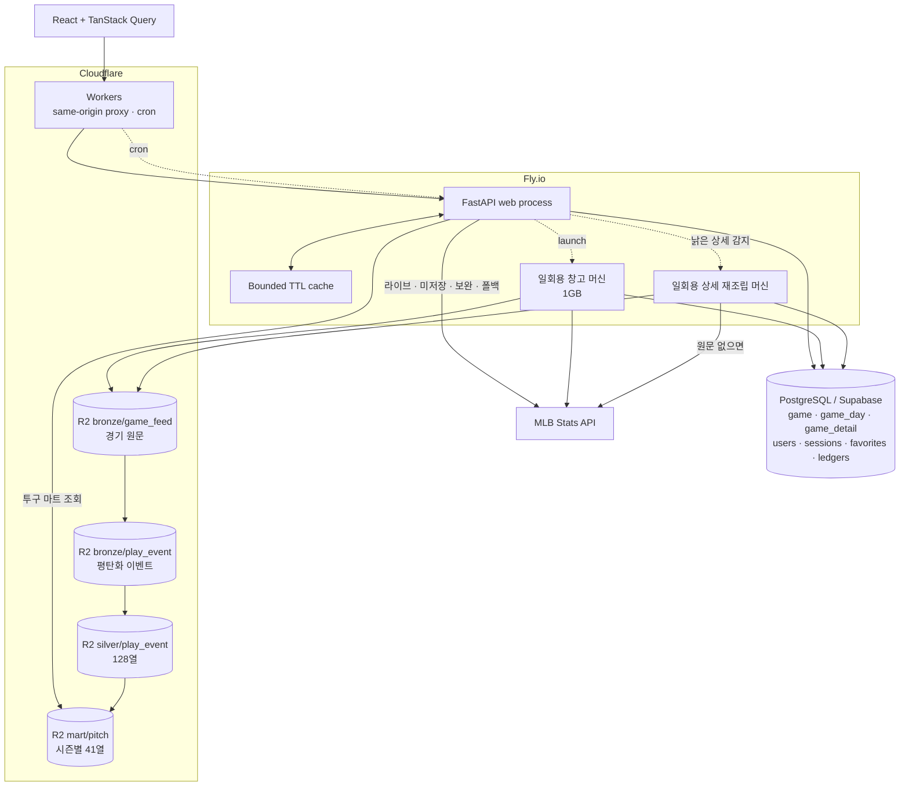
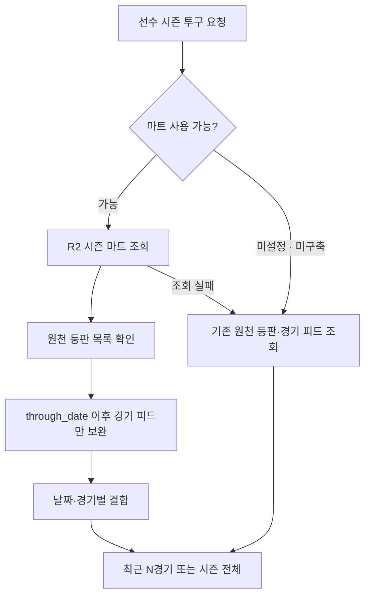

# Architecture

## 1. Current architecture

Sport Data Hub는 MLB Stats API를 원천으로 쓰며, 확정된 일정·저장된 경기 상세·시즌 투구 분석을 자체 저장소에서 읽습니다. 라이브, 미저장 데이터, 최신 등판 보완과 장애 폴백에는 원천 호출이 남아 있습니다.

기준 버전과 확인한 코드 경로는 [동기화 기록](source-sync.md)에 있습니다.



웹 요청, 영속 저장, 분석용 변환을 분리합니다. 모든 데이터를 하나의 저장소에 넣기보다 화면이 묻는 단위와 재처리 단위를 기준으로 경계를 정합니다.

## 2. Product surfaces and read paths

| 화면 | 제공하는 경험 | 주요 읽기 경로 |
|---|---|---|
| 홈 | 검색, 인기 선수 TOP 10, 라이브 티커, 대표팀 우선 스코어보드 | 확정된 날짜는 DB, 나머지는 원천과 캐시 |
| 선수 상세 | 경기 기록·프로파일, 시즌 표, 등급, 게임로그, 존맵, 투구·타구 분포 | 프로필·기록 API와 캐시, 투구는 마트 우선 |
| 팀 상세 | 개요·라인업·로스터·트랜잭션·상대 전적 | 팀·선수·일정 데이터를 서비스 단위로 조합 |
| 리더보드 | 타자·투수·팀 비교 | 리그·시즌 데이터와 캐시 |
| 전체 일정 | 월·일 보기, 날짜 이동, 경기 상세 연결 | 확정된 날짜는 DB, 월간 미확정 범위는 원천 요청 한 번 |
| 경기 상세 | 요약·박스 스코어·경기 기록·경기 정보 | 현재 버전 종료 응답은 DB, 없거나 진행 중이면 원천 |

전체 일정의 현재 구현은 **월·일 보기**입니다. 제품 문서에 남아 있는 주 보기 표기보다 실제 화면 코드를 기준으로 합니다. 경기 상세의 탭·홈/원정·득점 또는 이닝 필터는 URL에 남고, 진행 중일 때만 60초마다 갱신합니다.

## 3. Schedule persistence and cache

매시간 경기 적재 잡이 최근 7일 중 미확정 날짜를 조회하고, 치러진 경기와 연기·취소를 함께 저장합니다. 편성 수와 종결 수가 맞으면 `game_day.settled_at`을 기록합니다. 일간 조회는 확정된 날짜를 DB에서 읽고, 월간 조회는 미확정 날짜들을 범위 요청 하나로 가져옵니다.

공식 경기일과 일정에 노출되는 날은 다릅니다. 같은 경기 ID가 연기 안내와 재편성 일정, 중단 전과 재개일 양쪽에 나올 수 있으므로, 공식 경기일이 데이터 행을 소유하고 `postponed_from`·`resumed_on`이 다른 날의 카드를 보존합니다.

| 데이터 | 현재 서버 캐시 정책 |
|---|---|
| 오늘·어제 스코어보드, 라이브 경기 상세 | 60초 |
| 그 외 날짜 일정, 월간 일정, 예정 경기 상세 | 10분 |
| 선수 응답·폴백 경기 투구 | 선수 캐시 설정값 |
| 리그 집계 | 24시간 |
| 팀 순위, 마트 장부 | 10분 |
| 확정된 일정·종료 상세·시즌 마트 | 영속 저장소가 기반 |

예전의 30초 스코어보드 캐시는 60초로 조정되었습니다. 프론트 폴링도 60초이므로 두 주기가 겹치면 점수 표시 지연은 최대 약 120초가 될 수 있습니다.

기존 개발 기록의 요청 34회에서 원천 호출 68 → 28 감소는 **당시 DB 읽기 전환의 측정 사례**입니다. 현재 전체 서비스의 호출 수나 캐시 적중률을 뜻하지 않습니다.

## 4. Pitch detail: mart first, recent games from upstream



`mart_build.through_date`가 마트의 마지막 적재일입니다. 마트가 있어도 등판 목록 조회는 남습니다. 따라서 “원천 호출 0회”나 “조회 한 번으로 모든 요청 완료”로 설명하지 않습니다.

마트에는 경기 유형을 보존하고, 투수 상세가 올스타전을 제외합니다. 경기 유형이 NULL인 행까지 사라지지 않게 SQL은 `IS DISTINCT FROM 'A'`를 사용합니다. 좌표 없는 투구를 거르기 **전에** 타석 결과를 전파해 마지막 투구가 필터에서 빠져도 결과를 잃지 않게 합니다.

DuckDB 연결은 프로세스에서 재사용하고 요청별 cursor로 분리합니다. 프로세스 시작 시 연결을 예열하며, R2 HTTP timeout과 재시도 횟수를 제한해 실패 시 원천으로 돌아갑니다. 이 설정을 전체 요청의 엄격한 5초 제한으로 해석하지는 않습니다.

축약 흐름은 [Pitch Pipeline Example](../examples/pitch-pipeline.py)에 있습니다.

## 5. Game detail: stored response and rebuildable source

종료 경기 상세는 `game_detail`에 gzip 응답과 `source_version`을 저장합니다. 현재 버전의 행이 있으면 바로 복원하고, 없거나 낡으면 `feed/live`로 조립해 저장합니다. 진행 중·예정 경기는 응답 캐시만 사용합니다. 저장 시 최근 5시즌 범위만 유지합니다.

원문과 응답은 역할이 다릅니다.

- **R2 원문:** `bronze/game_feed`에 경기당 한 행으로 JSON 문자열을 보관합니다. 응답 구조가 바뀌어도 조립 재료가 남습니다.
- **DB 응답:** 화면이 바로 읽을 형태로 압축해 보관합니다. 버전이 맞아야 재사용합니다.
- **재조립:** 매시간 잡이 낡은 상세를 감지하면 일회용 머신을 띄웁니다. 현재 자동 명령은 올해 시즌을 대상으로 하며, 과거 시즌은 시즌을 지정하는 CLI 경로가 있습니다. 날짜별 원문을 읽어 다시 조립하고, 원문이 없거나 읽지 못한 경기는 원천 피드로 보완합니다.

원문을 재사용해도 팀명·순위·상대 전적 같은 부가 정보 조회는 별도로 남을 수 있습니다. “원천 호출 0회”는 저장된 현재 버전 응답을 읽는 경로에 한정합니다.

## 6. Batch execution

| 트리거 | 작업 | 실행 위치 |
|---|---|---|
| 매시간 | 최근 7일 미확정 일정·종료 상세 적재 | 웹 프로세스 |
| 매시간, 낡은 상세가 있을 때 | 현재 시즌 경기 상세 재조립 | 일회용 Fly 머신 |
| 하루 1회, 3~11월 | 포스트시즌 진출 확률, 5만 회 시뮬레이션 | 웹 프로세스 |
| 하루 1회, 3~11월 | 경기 원문·이벤트 → 실버 → 투구 마트 | 일회용 Fly 머신, 1GB |

Workers는 60초 수명의 잡 JWT로 내부 엔드포인트를 호출합니다. 창고 작업은 같은 이미지의 일회용 머신에서 실행하고, `restart=no`·자동 삭제로 종료 후 남지 않게 합니다.

창고 크론의 자동 보완 범위는 최근 3일입니다. 과거 백필은 별도 CLI로 처리합니다. 브론즈·실버 중 일부 날짜가 실패해도 뒤 단계를 시도하되, 마트는 브론즈에 대응하는 현재 버전 실버가 하나라도 빠지면 기존 파일을 유지합니다. 버전 변경 뒤 과거 실버를 채우지 않았다면 마트 갱신도 보류됩니다.

## 7. Warehouse layers

```text
bronze/game_feed/season=2026/date=2026-09-08/feeds.parquet
bronze/play_event/season=2026/date=2026-09-08/events.parquet
silver/play_event/season=2026/date=2026-09-08/events.parquet
mart/pitch/season=2026/pitches.parquet
```

위 경로의 날짜는 구조를 설명하기 위한 예시입니다.

- 원문 브론즈는 전체 피드, 이벤트 브론즈는 `liveData.plays`를 평탄화한 행입니다. 두 파일의 누락을 따로 판단해 없는 쪽만 채웁니다.
- 실버는 128열(원본 유지 117 + 파생 11)이며 브론즈와 행 수가 같아야 합니다. 타입 변환·행 수 검사를 통과한 뒤 파일을 쓰고 장부를 기록합니다.
- 투구 마트는 41열이며 `is_pitch` 행만 남깁니다. 시즌 파일 하나로 합쳐 투수·날짜·경기·타석·투구 순으로 정렬하고 20,000행 그룹을 사용합니다.
- 드리프트는 브론즈 적재를 막는 관문이 아니라 기록과 알림입니다. 실버의 변환 실패와 마트의 불완전 입력은 갱신을 막습니다.

자세한 판단은 [Data Strategy](data-strategy.md)에 있습니다.

## 8. User behavior, deployment and observability

인기 선수는 검색 문자열 횟수보다 실제 선수 상세 조회를 기준으로 집계합니다. 관심 선수·대표팀·세션은 PostgreSQL에 저장합니다.

GitHub Actions의 테스트·마이그레이션 왕복·프론트 빌드 이후 Fly.io 블루그린 배포와 Cloudflare 배포를 수행하는 구조입니다. Sentry와 Slack이 오류·배치 실패를 관찰하고, 백엔드가 내려간 순간의 크론 실패는 Workers에서도 알립니다.

## 9. Current limitations

- process-local 캐시는 여러 인스턴스 사이에서 공유되지 않습니다.
- 라이브·미저장 데이터·최신 등판·장애 폴백은 여전히 원천에 의존합니다.
- 일일 크론은 최근 날짜만 복구합니다. 과거 실버 버전 변경과 백로그는 별도 처리가 필요합니다.
- 마트는 시즌 전체를 다시 만듭니다. 데이터 규모가 커지면 빌드 메모리·시간을 다시 측정해야 합니다.
- 스프레이·무브먼트에 필요한 열은 마트에 있지만, 해당 새 시각화가 완성된 것은 아닙니다.
