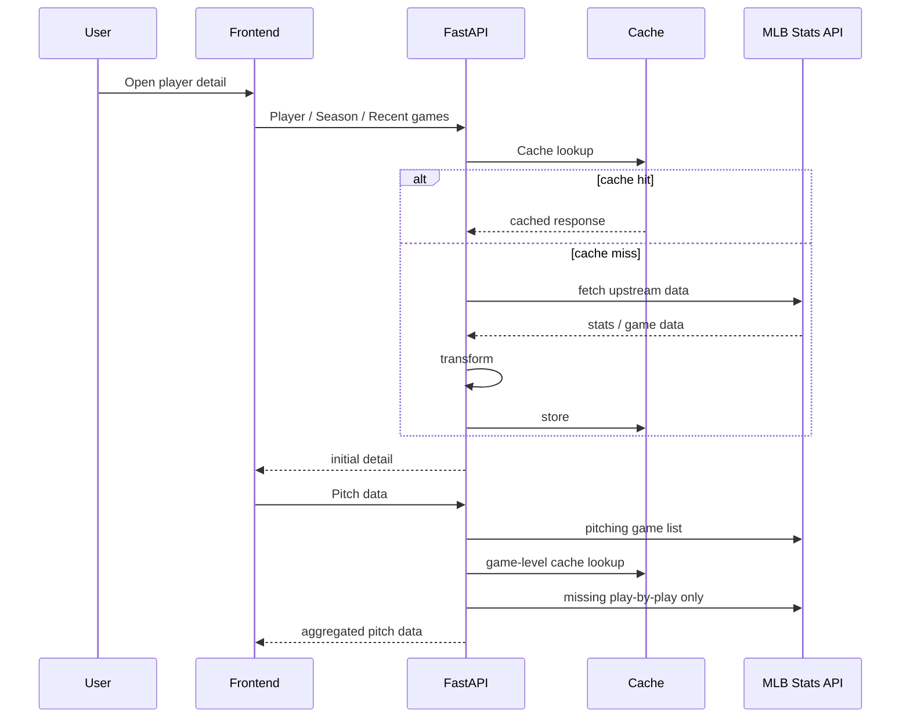
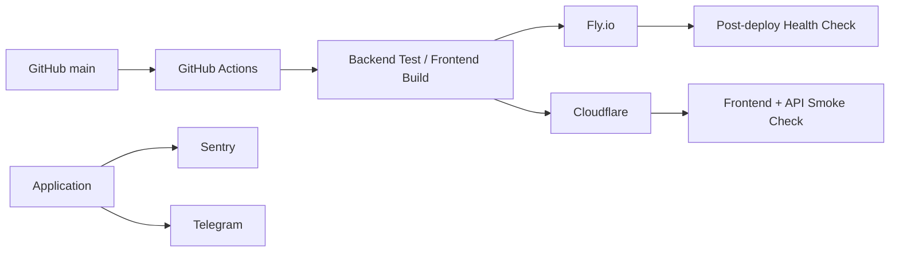

# Architecture

## 1. Current architecture

현재 Sport Data Hub는 **MLB Stats API를 원천으로 사용하고, FastAPI에서 서비스에 필요한 형태로 가공한 뒤 React에 제공하는 구조**입니다.

```mermaid
flowchart TB
    subgraph Source
        MLB[MLB Stats API]
    end

    subgraph Backend
        Client[MLB API Client]
        Service[Domain / Service Layer]
        Cache[Bounded TTL Cache]
        API[FastAPI Router]
        Health[/health]
    end

    subgraph Persistence
        PG[(PostgreSQL / Supabase)]
        Views[Player View Events]
        Favorites[Favorite Players]
        Auth[Auth Sessions]
    end

    subgraph Frontend
        React[React]
        Query[TanStack Query]
    end

    MLB --> Client
    Client --> Service
    Service <--> Cache
    Service --> API
    API --> Query
    Query --> React

    React -->|view / favorite| API
    API --> PG
    PG --> Views
    PG --> Favorites
    PG --> Auth

    Cache --> Health
```

핵심은 원천 API 응답을 그대로 전달하지 않고, **사용자가 실제로 탐색하는 단위로 데이터를 다시 구성한다는 점**입니다.

예를 들어 한 선수의 상세 화면에는 선수 기본 정보뿐 아니라 최근 경기, 시즌 기록, zone, 투구 데이터 등 서로 다른 endpoint와 처리 과정을 통해 만들어진 데이터가 함께 사용됩니다.

## 2. Why an application cache exists

선수 상세 정보의 체감 latency는 Backend 내부 연산보다 **외부 MLB API 호출 횟수와 응답 시간**에 크게 영향을 받습니다.

처음에는 서비스별로 단순한 in-memory dictionary cache가 추가되었지만 기능이 늘면서 다음 문제가 생겼습니다.

- cache마다 정책이 달라짐
- entry 수에 상한이 없음
- 만료 entry 정리 방식에 동시성 위험이 있음
- cache가 현재 얼마나 사용되는지 관찰하기 어려움

그래서 cache interface를 한 곳으로 모으고 다음 원칙을 적용했습니다.

- bounded size
- TTL
- cache별 lock
- hit / miss / size 관찰
- 외부에서는 get/set interface만 사용

이 구조의 목적은 특정 cache library에 종속되는 것이 아닙니다. 이후 Redis 등 process 외부 저장소로 옮겨야 할 때 application code에 미치는 영향을 줄이는 것이 더 중요한 목표입니다.

## 3. Cache by data characteristics

모든 데이터를 같은 TTL로 관리하지 않습니다.

| Data | Current strategy | Reason |
|---|---|---|
| Player / season responses | Hour-level cache | 경기 종료 후 갱신되는 데이터가 중심 |
| League aggregates | Day-level cache | 선수별 요청마다 다시 계산할 필요가 적음 |
| Game play-by-play | Game-level cache | 같은 경기 데이터를 여러 선수 화면에서 재사용 가능 |
| User views | PostgreSQL | ranking과 향후 행동 분석을 위해 지속성이 필요 |
| Favorites / auth | PostgreSQL | 사용자 상태이므로 지속 저장 필요 |

완료된 경기의 play-by-play처럼 사실상 immutable한 데이터는 장기적으로 process cache에만 두기보다 별도 저장 계층으로 옮기는 것이 더 적합하다고 보고 있습니다.

## 4. Player detail request

투수 상세 화면은 한 번의 API 호출만으로 만들어지지 않습니다.



최근 경기 데이터를 먼저 보여주고 전체 시즌 데이터를 이어서 요청할 때 경기 단위 cache를 재사용할 수 있도록 요청 순서와 cache boundary를 함께 고려했습니다.

## 5. User behavior as product data

Sport Data Hub는 스포츠 원천 데이터만 다루지 않습니다. 서비스에서 발생하는 사용자 행동도 데이터 자산으로 봅니다.

현재는 선수 상세 조회를 기록합니다.

```text
player_id
viewed_at
source      # search / popular / favorite / direct
query       # 검색을 통해 들어온 경우
```

인기 선수는 검색어 횟수가 아니라 **실제로 어떤 선수 상세를 열어봤는가**를 기준으로 집계합니다. 검색어 하나가 여러 선수를 가리킬 수 있기 때문입니다.

이 데이터는 현재 인기 선수 기능에 사용하지만, 장기적으로는 사용자의 스포츠 데이터 탐색 패턴을 이해하는 기반으로 확장할 수 있습니다.

## 6. Deployment and observability



배포 command가 성공하는 것과 실제 서비스가 정상적으로 응답하는 것은 별개라고 보고, 배포 후 health/API endpoint를 직접 확인합니다.

또한 Backend/Frontend 오류를 Sentry와 alerting으로 연결해 사용자가 먼저 장애를 발견하기 전에 확인할 수 있는 운영 구조를 만들고 있습니다.

## 7. Current limitation

현재 구조에는 명확한 한계도 있습니다.

- process-local cache는 instance가 늘어나면 공유되지 않음
- 재배포/재시작 시 cache가 사라짐
- 외부 API에 여전히 강하게 의존
- 과거 경기와 같은 immutable data도 upstream API에서 다시 가져올 수 있음
- 분석 요구가 복잡해질수록 serving request 안에서 계산하기 어려워짐

이 한계 때문에 cache를 계속 확장하는 것이 정답이라고 보지 않습니다. 데이터 재사용률과 분석 요구가 충분히 커지는 시점에는 Redis와 DW/DB를 목적에 따라 분리해 도입하는 방향을 검토하고 있습니다.

See: [Data Strategy](data-strategy.md)
