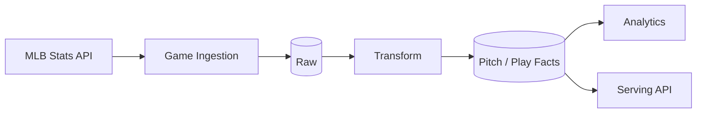

# Data Strategy

## Goal

Sport Data Hub의 장기 목표는 기록 조회 페이지가 아니라 **팀과 선수를 데이터로 이해할 수 있는 분석 플랫폼**입니다.

이를 위해서는 화면 요청이 올 때마다 외부 API를 호출하는 방식만으로는 충분하지 않습니다. 데이터의 변경 주기, 재사용성, 분석 비용에 따라 **API / Cache / Operational DB / Warehouse**의 역할을 나누는 것이 필요합니다.

## 1. Data classification

### A. Frequently changing serving data

예:
- 진행 중 경기
- 경기 상태
- 점수

특징:
- 최신성이 중요
- 장기 저장보다 짧은 조회 주기가 중요

현재 방향:
```text
Source API → short-lived cache → Serving API
```

### B. Slowly changing player data

예:
- 선수 프로필
- 현재 팀
- 시즌 누적 기록

특징:
- 매 요청마다 upstream을 호출할 필요가 없음
- 경기 단위 또는 시간 단위로 변함

현재 방향:
```text
Source API → player-level cache → Serving API
```

### C. Immutable / historical game data

예:
- 종료된 경기 play-by-play
- 과거 투구 데이터
- 이전 시즌 기록

특징:
- 경기가 종료된 이후 거의 변하지 않음
- 여러 분석에서 반복 사용 가능
- cache에서 계속 다시 가져오는 것보다 저장 가치가 높음

향후 방향:
```text
Source API
   ↓
Ingestion
   ↓
Raw Game Data
   ↓
Normalized / Curated Data
   ↓
Analytics + Serving
```

### D. Product behavior data

예:
- 선수 조회
- 관심 선수
- 검색 진입 경로

특징:
- 원천 스포츠 API에는 존재하지 않음
- 서비스가 직접 만드는 데이터
- 제품 개선과 추천에 활용 가능

현재:
```text
User action → FastAPI → PostgreSQL
```

## 2. Cache or Warehouse?

새 데이터를 무조건 cache하거나 무조건 DW에 적재하지 않습니다.

다음 질문을 기준으로 판단합니다.

1. 데이터가 얼마나 자주 바뀌는가?
2. 같은 데이터를 얼마나 자주 다시 읽는가?
3. 원천 API latency와 호출 비용은 어느 정도인가?
4. 원천을 다시 호출해도 되는 데이터인가?
5. 여러 사용자/분석이 같은 데이터를 재사용하는가?
6. request path에서 계산하기에 연산량이 큰가?
7. 과거 시점의 상태를 다시 분석해야 하는가?

### Example: completed play-by-play

현재 경기별 play-by-play는 cache 대상입니다.

그러나 완료된 경기는 더 이상 바뀌지 않기 때문에 사용자와 분석 기능이 늘어난다면 아래와 같은 구조가 더 적합합니다.



이렇게 되면 선수 상세 페이지뿐 아니라 팀 분석, 구종 분석, matchup 분석 등 여러 기능이 같은 데이터를 재사용할 수 있습니다.

## 3. Proposed warehouse layers

아직 production으로 구축한 구조는 아니며 향후 확장안입니다.

### Raw

원천 데이터를 가능한 한 원형에 가깝게 저장합니다.

예:
```text
raw_games
raw_play_by_play
raw_players
raw_rosters
```

목적:
- 원천 변경 대응
- 재처리 가능성 확보
- 데이터 lineage 유지

### Curated

서비스가 공통으로 사용하는 의미 단위로 정규화합니다.

예:
```text
dim_player
dim_team
fact_game
fact_player_game
fact_pitch
```

### Analytics

제품 기능에 가까운 파생 데이터를 만듭니다.

예:
```text
team_strength_profile
player_skill_profile
team_position_need
player_team_fit
```

## 4. From stats to team diagnosis

최종적으로 만들고 싶은 기능은 단순한 리더보드가 아닙니다.

예를 들어 한 팀을 다음과 같이 설명할 수 있어야 합니다.

```text
Team
 ├─ Run creation
 ├─ Plate discipline
 ├─ Contact quality
 ├─ Starting pitching
 ├─ Bullpen
 ├─ Defense
 └─ Positional depth
```

각 축을 리그 평균 및 유사 팀과 비교하면 팀의 강점과 약점을 구조적으로 설명할 수 있습니다.

그 다음 단계는 선수 데이터와 연결하는 것입니다.

```text
Team weakness
   ↓
Required skill profile
   ↓
Candidate player filtering
   ↓
Player-team fit score
   ↓
Explanation
```

중요한 목표는 단순 점수 하나를 보여주는 것이 아니라 **왜 이 선수가 이 팀에 필요한지를 데이터로 설명하는 것**입니다.

## 5. Multi-sport direction

모든 스포츠의 스키마를 억지로 하나로 합치는 것을 목표로 하지는 않습니다.

야구의 pitch, Formula 1의 lap, 농구의 possession은 같은 event가 아닙니다. 따라서 세부 fact는 스포츠별 모델을 유지하는 편이 자연스럽습니다.

대신 사용자 경험과 상위 분석 개념에서 공통 축을 찾습니다.

예:
```text
Sport
Team / Constructor
Player / Driver
Season
Event / Game / Race
Performance Metric
Ranking
Strength / Weakness
```

즉 **storage model의 완전한 통합보다, 분석과 탐색 경험의 통합**을 지향합니다.
