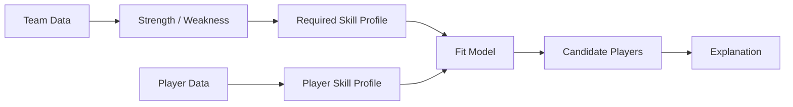

# Roadmap

Sport Data Hub는 **MLB-first**로 개발하고 있습니다. 처음부터 여러 스포츠를 억지로 하나의 데이터 모델에 넣기보다 MLB에서 실제 사용자 경험과 데이터 구조를 충분히 검증한 뒤 확장하는 전략입니다.

기능 후보는 다음 네 질문 중 하나에 답해야 자리를 얻습니다.

1. 이 선수는 리그에서 어느 정도 수준인가?
2. 현재 결과가 실제 경기력과 일치하는가?
3. 최근 좋아지고 있는가, 나빠지고 있는가?
4. 이 선수는 어떤 방식으로 플레이하는 선수인가?

## Phase 1 — MLB Explorer

**Status: 운영 중**

구현된 것:
- 홈: 라이브 티커, 선수 검색, 인기 검색 TOP 10, 스코어보드(대표팀 우선)
- 선수 상세: 시즌 표(최근 3시즌 · 10시즌 · 전 기간), 등급 카드, 게임로그, 최근 vs 시즌, 존 핫·콜드 맵, 구종별 투구 위치, 발사각·타구속도 분포, 신인 배지
- 팀 상세: 개요, 로스터, 트랜잭션, 상대 전적, 핵심 선수, 상승세·하락세, 선발 로테이션, 부상자 명단, 포스트시즌 진출 확률
- 리더보드
- 구글 로그인, 관심 선수, 대표팀, 계정 삭제
- 한국어·영어, 라이트·다크, 보는 사람의 시간대로 날짜 표시
- 블루그린 배포, CI(테스트 · 마이그레이션 왕복 · 빌드), 슬랙 알림, Sentry

다음:
- 스탯캐스트 · 용어집 메뉴(자리만 있고 화면이 없음)
- 비시즌(11~2월)의 시즌 연도 표기
- 관심 선수 선발 등판 알림(디스코드·슬랙 웹훅부터)

## Phase 2 — Persistent Sports Data

**Status: 진행 중. 브론즈·실버 완료, 마트 진행 예정**

목표:
- 반복 조회되는 historical data를 외부 API와 process cache에서 분리
- 분석 기능을 위한 재사용 가능한 데이터 기반 구축

완료:
- 끝난 경기 결과를 Postgres에 쌓고 화면이 그것을 읽는다(원천 호출 68 → 28)
- 경기 피드를 Cloudflare R2에 Parquet으로 쌓는 브론즈 층. 값 무변환, 날짜 단위, 매일 자동
- 고정 스키마 실버 층. SQL 한 문장, 행 수 강제, 장부와 버전
- 드리프트 센싱(처음 보는 열·타입 변경·처음 보는 값·사라진 열)
- 배치를 웹 프로세스 밖의 일회용 머신에서 돌리는 구조
- 시즌 백필(2026년 3월 25일부터)

다음:
- 마트 층: 시즌 파일 하나, 투구만, 화면 열만
- 읽기 전환: 투수 상세가 원천 대신 마트를 읽는다
- 데이터 확보 현황을 보고 정한 기능 순서: 퍼센타일 프로파일(질문 ①), 실제 대 기대(②), 롤링 트렌드(③), 스프레이 산포도·구종 무브먼트(④). 퍼센타일은 리그 리더보드가 출현 횟수를 함께 줘서 창고 없이도 분포를 계산할 수 있고, 스프레이와 무브먼트는 창고가 있어야 합니다
- 수비·주루, 배트 트래킹은 원천에 데이터가 없어 다른 출처를 찾기 전까지 착수할 수 없습니다

## Phase 3 — Team Analytics

목표:
- "이 팀은 현재 무엇을 잘하고 무엇이 부족한가?"를 데이터로 설명

예:
- 공격 생산성
- plate discipline
- contact quality
- 선발/불펜
- 수비
- 포지션 depth

단순 ranking보다 리그 평균, 유사 팀, 최근 추세 등을 함께 보여주는 방향을 검토합니다. 팀 상세의 개요 탭이 이 방향의 첫 자리입니다.

## Phase 4 — Player Fit / Roster Recommendation

목표:
- 팀의 약점을 선수의 skill profile과 연결

예:
- 좌완 상대 장타 생산이 부족한 팀
- 특정 포지션 수비 depth가 부족한 팀
- bullpen strikeout rate가 낮은 팀

에 대해 필요한 skill profile을 정의하고 후보 선수를 찾는 방식입니다. 아직 설계가 없고 방향으로만 있습니다.

## Phase 5 — Multi-sport Platform

MLB에서 검증한 제품 구조를 다른 스포츠로 확장합니다.

중요한 원칙:
- 스포츠별 세부 데이터 모델은 억지로 통합하지 않음
- 공통 탐색 경험과 상위 분석 개념을 통합
- 각 스포츠의 원천 데이터 품질과 API 특성을 별도로 고려

후보 도메인:
- KBO
- Formula 1
- 이후 데이터 접근성과 분석 가치가 충분한 스포츠

최종적으로는 사용자가 하나의 서비스에서 여러 스포츠의 선수/팀/시즌 데이터를 탐색하고, 각 스포츠의 맥락에 맞는 분석을 받을 수 있는 플랫폼을 목표로 합니다.
