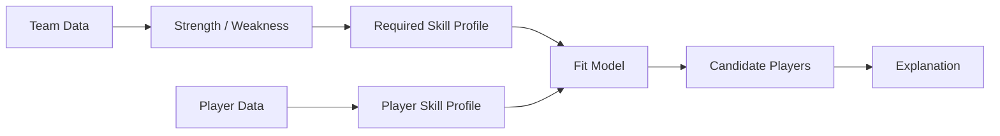

# Roadmap

Sport Data Hub는 **MLB-first**로 개발하고 있습니다. 처음부터 여러 스포츠를 억지로 하나의 데이터 모델에 넣기보다 MLB에서 실제 사용자 경험과 데이터 구조를 충분히 검증한 뒤 확장하는 전략입니다.

## Phase 1 — MLB Explorer

**Status: In progress**

목표:
- 일반 팬이 복잡한 야구 데이터를 쉽게 탐색
- 선수 검색에서 세부 분석까지 한 흐름으로 연결

현재 구현:
- 선수 검색
- 선수 상세
- 시즌 기록
- 최근 경기 기록
- 스코어보드
- zone / pitch 데이터
- 인기 선수
- 관심 선수
- 로그인
- 배포 및 오류 관찰

다음:
- 데이터 설명과 glossary 강화
- 각 지표의 리그 평균/percentile 맥락 제공
- 선수 비교 UX
- detail page latency와 failure behavior 지속 개선

## Phase 2 — Persistent Sports Data

목표:
- 반복 조회되는 historical data를 외부 API와 process cache에서 분리
- 분석 기능을 위한 재사용 가능한 데이터 기반 구축

후보:
- completed games ingestion
- play-by-play / pitch history 저장
- raw / curated layer
- data freshness policy
- backfill / incremental ingestion
- data quality validation

이 단계부터는 cache가 아니라 **data pipeline / warehouse 문제**로 다루는 범위가 커집니다.

## Phase 3 — Team Analytics

목표:
- "이 팀은 현재 무엇을 잘하고 무엇이 부족한가?"를 데이터로 설명

예:
- 공격 생산성
- plate discipline
- contact quality
- 선발/불펜
- 수비
- 포지션 depth

단순 ranking보다 리그 평균, 유사 팀, 최근 추세 등을 함께 보여주는 방향을 검토합니다.

## Phase 4 — Player Fit / Roster Recommendation

목표:
- 팀의 약점을 선수의 skill profile과 연결

예:
- 좌완 상대 장타 생산이 부족한 팀
- 특정 포지션 수비 depth가 부족한 팀
- bullpen strikeout rate가 낮은 팀

에 대해 필요한 skill profile을 정의하고 후보 선수를 찾는 방식입니다.

## Phase 5 — Multi-sport Platform

MLB에서 검증한 제품 구조를 다른 스포츠로 확장합니다.

중요한 원칙:
- 스포츠별 세부 데이터 모델은 억지로 통합하지 않음
- 공통 탐색 경험과 상위 분석 개념을 통합
- 각 스포츠의 원천 데이터 품질과 API 특성을 별도로 고려

후보 도메인:
- KBO
- Formula 1
- 이후 데이터 접근성과 분석 가치가 충분한 스포츠

최종적으로는 사용자가 하나의 서비스에서 여러 스포츠의 선수/팀/시즌 데이터를 탐색하고, 각 스포츠의 맥락에 맞는 분석을 받을 수 있는 플랫폼을 목표로 합니다.
