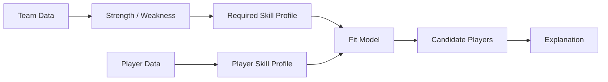

# Roadmap

Sport Data Hub는 **MLB-first**로 개발하고 있습니다. 처음부터 여러 스포츠를 억지로 하나의 데이터 모델에 넣기보다 MLB에서 실제 사용자 경험과 데이터 구조를 충분히 검증한 뒤 확장하는 전략입니다.

기능 후보는 다음 네 질문 중 하나에 답해야 자리를 얻습니다.

1. 이 선수는 리그에서 어느 정도 수준인가?
2. 현재 결과가 실제 경기력과 일치하는가?
3. 최근 좋아지고 있는가, 나빠지고 있는가?
4. 이 선수는 어떤 방식으로 플레이하는 선수인가?

## Phase 1 — MLB Explorer

**Status: 운영 중**

구현된 것:
- 홈: 라이브 티커, 선수 검색, 인기 검색 TOP 10, 스코어보드(대표팀 우선)
- 선수 상세: 시즌 표(최근 3시즌 · 10시즌 · 전 기간), 등급 카드, 게임로그, 최근 vs 시즌, 존 핫·콜드 맵, 구종별 투구 위치, 발사각·타구속도 분포, 신인 배지
- 팀 상세: 개요, 로스터, 라인업(타순별 출전·OPS·변화), 트랜잭션, 상대 전적, 핵심 선수, 상승세·하락세, 선발 로테이션, 부상자 명단, 포스트시즌 진출 확률
- 리더보드: 타자·투수·팀
- 전체 일정: 월·일 보기, 날짜 이동, 경기 상세 연결
- 경기 상세: 요약·박스 스코어·경기 기록·경기 정보, 득점·이닝 필터, 라이브 60초 갱신
- 구글 로그인, 관심 선수, 대표팀, 계정 삭제
- 한국어·영어, 라이트·다크, 보는 사람의 시간대로 날짜 표시
- 블루그린 배포, CI(테스트 · 마이그레이션 왕복 · 빌드), 슬랙 알림, Sentry

다음:
- 비시즌(11~2월)의 시즌 연도 표기
- 관심 선수 선발 등판 알림(디스코드·슬랙 웹훅부터)

## Phase 2 — Persistent Sports Data

**Status: 브론즈·실버·투구 마트 및 마트 우선 조회 구현 완료. 분석 화면 확장 예정**

목표:
- 반복 조회되는 historical data를 외부 API와 process cache에서 분리
- 분석 기능을 위한 재사용 가능한 데이터 기반 구축

완료:
- 확정된 경기 일정과 현재 버전 종료 상세를 Postgres에서 읽는다
- 경기 전체 원문과 평탄화 이벤트를 Cloudflare R2에 각각 저장하는 브론즈 층. 날짜 단위로 없는 파일만 보완
- 고정 128열 실버 층. SQL 한 문장, 행 수 강제, 장부와 버전
- 41열 투구 마트. 시즌 파일 하나, 투수순 정렬, 20,000행 그룹
- 투수 상세의 마트 우선 조회, 적재일 이후 등판 보완, 마트 실패 시 원천 폴백
- 경기 상세의 응답 버전 관리와 저장된 원문 기반 재조립
- 연기·재개일 카드 보존
- 드리프트 센싱(처음 보는 열·타입 변경·처음 보는 값·사라진 열)
- 창고·상세 재조립을 웹 프로세스 밖의 일회용 머신에서 돌리는 구조
- 날짜·시즌 지정 백필 경로. 과거 데이터의 실제 적재 범위는 운영 장부로 확인해야 한다

다음 분석 확장:

| 우선순위 | 기능 | 데이터와 상태 |
|---|---|---|
| S | 퍼센타일 프로파일 | Savant 퍼센타일 CSV에 값이 직접 제공됨을 소스 로드맵에서 확인. 서비스 연동은 예정 |
| S | 실제 대 기대 | Stats API의 xBA·xSLG·xwOBA, Savant의 xERA 조사 완료. 기존 ERA↔FIP 경험을 확장 |
| S | 롤링 트렌드 | 최근 7·15·30경기와 시즌 기준을 비교하는 차트 예정 |
| S / A | 스프레이·구종 무브먼트 | 마트에 좌표·변화량을 확보. 화면 구현 예정 |
| A | 타자 선구안·구종 요약·홈런 프로파일 | 기존 피드와 집계 재사용. 구종 Run Value·xHR은 확보되지 않음 |
| B | 선수 스타일·리그/포지션 순위·수비/주루 | 규칙 기반 스타일과 비교 맥락을 설계. Sprint Speed·OAA·Arm Strength는 Savant CSV에서 확보 가능 |
| C | 배트 트래킹·스윙 프로파일 | 배트 스피드·스윙 길이·Squared-Up%는 Savant CSV에서 확보 가능. 어택 앵글은 미확보 |

**데이터가 오는 것과 서비스에 붙은 것은 다릅니다.** 위 출처 판정은 소스 로드맵의 2026-09-05·09-08 조사 기록이며, 이번 갱신에서 외부 API를 다시 호출해 검증한 결과는 아닙니다. 수비·주루와 배트 트래킹은 “출처 없음”에서 “데이터 확보 가능, 연동 예정”으로 바뀌었습니다.

Savant CSV는 문서화된 공식 API가 아니라 사이트에서 사용하는 경로입니다. 컬럼 변경·실패 시 해당 카드만 비우는 방식과 최소 표본 기준을 연동 단계에서 함께 설계해야 합니다. Run Value 계열·Fielding Run Value·xHR은 출처를 확보하지 못했고, 구장별 홈런 여부도 추가 확인이 필요합니다.

퍼센타일은 창고 없이도 시작할 수 있고, 선구안은 기존 이벤트를 타자 관점으로 집계할 수 있습니다. 스프레이와 무브먼트는 공통 마트 기반을 활용하는 순서로 검토합니다.

## Phase 3 — Team Analytics

목표:
- "이 팀은 현재 무엇을 잘하고 무엇이 부족한가?"를 데이터로 설명

예:
- 공격 생산성
- plate discipline
- contact quality
- 선발/불펜
- 수비
- 포지션 depth

단순 ranking보다 리그 평균, 유사 팀, 최근 추세 등을 함께 보여주는 방향을 검토합니다. 팀 상세의 개요 탭이 이 방향의 첫 자리입니다.

## Phase 4 — Player Fit / Roster Recommendation

목표:
- 팀의 약점을 선수의 skill profile과 연결

예:
- 좌완 상대 장타 생산이 부족한 팀
- 특정 포지션 수비 depth가 부족한 팀
- bullpen strikeout rate가 낮은 팀

에 대해 필요한 skill profile을 정의하고 후보 선수를 찾는 방식입니다. 아직 설계가 없고 방향으로만 있습니다.

## Phase 5 — Multi-sport Platform

MLB에서 검증한 제품 구조를 다른 스포츠로 확장합니다.

중요한 원칙:
- 스포츠별 세부 데이터 모델은 억지로 통합하지 않음
- 공통 탐색 경험과 상위 분석 개념을 통합
- 각 스포츠의 원천 데이터 품질과 API 특성을 별도로 고려

확장 방향:
- NBA·NFL: 제품 문서에서 명시한 다종목 확장 방향
- KBO·Formula 1: 헤더의 예정 종목과 후보 범위

다른 종목은 아직 MLB와 같은 수준으로 구현되지 않았습니다. 종목별 데이터 확보와 우선순위 검증이 선행되어야 합니다.

최종적으로는 사용자가 하나의 서비스에서 여러 스포츠의 선수/팀/시즌 데이터를 탐색하고, 각 스포츠의 맥락에 맞는 분석을 받을 수 있는 플랫폼을 목표로 합니다.

기준 버전과 현재 구현의 근거는 [동기화 기록](source-sync.md)에 있습니다.
